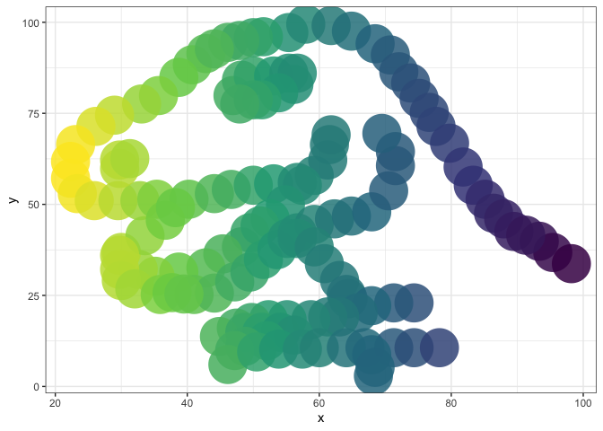
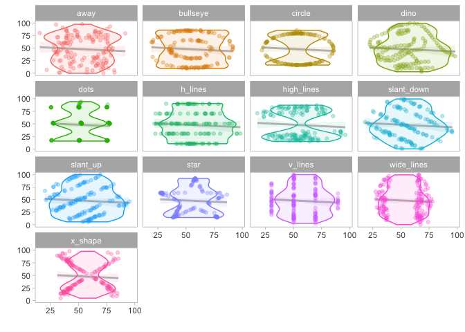
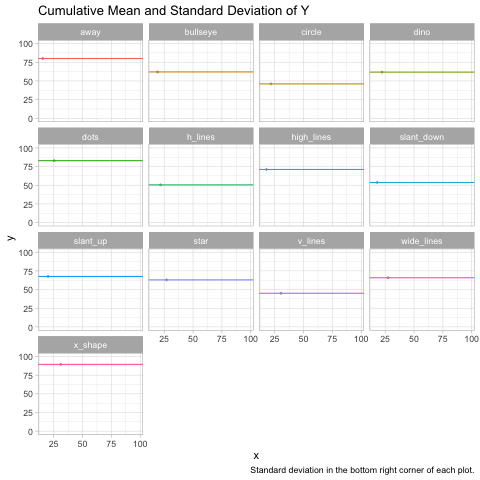
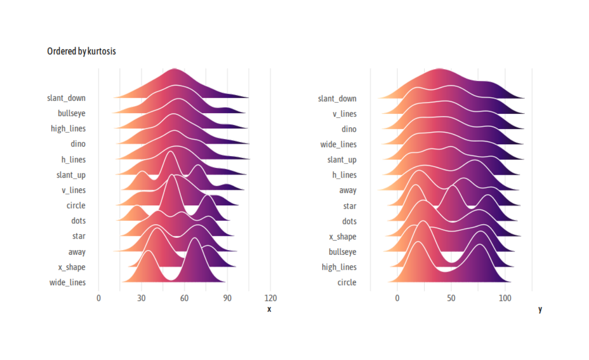

The Datasaurus 🦖
================

## TidyTuesday 2020-10-13

If you want to join the next CorrelAid TidyTuesday Meetup, make sure to
sign up to our
[Newsletter](https://correlaid.us12.list-manage.com/subscribe?u=b294bf2834adf5d89bdd2dd5a&id=915f3f3eff)
or reach out to us on [Twitter](https://twitter.com/CorrelAid)\!

``` r
library(tidyverse)
library(tidytuesdayR)
library(ggplot2)
library(fontawesome) # for knitting, install with devtools::install_github("rstudio/fontawesome")
tt <- tt_load("2020-10-13")
```

    ## 
    ##  Downloading file 1 of 1: `datasaurus.csv`

### A colorful dino\!

**By Christina**

``` r
datasaurus_dozen <- tt$datasaurus
ggplot(dplyr::filter(datasaurus_dozen, dataset=='dino'), aes(x, y, colour=-x)) +
  geom_point(size=15, alpha=0.85, shape=16) + theme_bw() +
  theme(legend.position = "none") +
  scale_color_continuous(type = "viridis")
```

<!-- -->

### A colorful violin plot

**By Lisa Reiber**
[<svg style="height:0.8em;top:.04em;position:relative;fill:#1da1f2;" viewBox="0 0 512 512"><path d="M459.37 151.716c.325 4.548.325 9.097.325 13.645 0 138.72-105.583 298.558-298.558 298.558-59.452 0-114.68-17.219-161.137-47.106 8.447.974 16.568 1.299 25.34 1.299 49.055 0 94.213-16.568 130.274-44.832-46.132-.975-84.792-31.188-98.112-72.772 6.498.974 12.995 1.624 19.818 1.624 9.421 0 18.843-1.3 27.614-3.573-48.081-9.747-84.143-51.98-84.143-102.985v-1.299c13.969 7.797 30.214 12.67 47.431 13.319-28.264-18.843-46.781-51.005-46.781-87.391 0-19.492 5.197-37.36 14.294-52.954 51.655 63.675 129.3 105.258 216.365 109.807-1.624-7.797-2.599-15.918-2.599-24.04 0-57.828 46.782-104.934 104.934-104.934 30.213 0 57.502 12.67 76.67 33.137 23.715-4.548 46.456-13.32 66.599-25.34-7.798 24.366-24.366 44.833-46.132 57.827 21.117-2.273 41.584-8.122 60.426-16.243-14.292 20.791-32.161 39.308-52.628 54.253z"/></svg>](https://twitter.com/lisa_reiber)

``` r
ttd <- tt$datasaurus
ttd %>% 
      ggplot(aes(x = x, y = y, fill = dataset, color = dataset)) +
      geom_smooth(method = "lm", alpha = 0.1, color = "grey") +
      geom_violin(alpha = 0.1) +
      geom_point(alpha = 0.3) +
      facet_wrap(~dataset) +
      theme_light() +
      theme(legend.position = "none",
            panel.grid = element_blank()) +
      labs(x = "", y = "") +
      NULL
```

    ## `geom_smooth()` using formula 'y ~ x'

<!-- -->

### An animation\!

**By Frie Preu**
[<svg style="height:0.8em;top:.04em;position:relative;fill:#1da1f2;" viewBox="0 0 512 512"><path d="M459.37 151.716c.325 4.548.325 9.097.325 13.645 0 138.72-105.583 298.558-298.558 298.558-59.452 0-114.68-17.219-161.137-47.106 8.447.974 16.568 1.299 25.34 1.299 49.055 0 94.213-16.568 130.274-44.832-46.132-.975-84.792-31.188-98.112-72.772 6.498.974 12.995 1.624 19.818 1.624 9.421 0 18.843-1.3 27.614-3.573-48.081-9.747-84.143-51.98-84.143-102.985v-1.299c13.969 7.797 30.214 12.67 47.431 13.319-28.264-18.843-46.781-51.005-46.781-87.391 0-19.492 5.197-37.36 14.294-52.954 51.655 63.675 129.3 105.258 216.365 109.807-1.624-7.797-2.599-15.918-2.599-24.04 0-57.828 46.782-104.934 104.934-104.934 30.213 0 57.502 12.67 76.67 33.137 23.715-4.548 46.456-13.32 66.599-25.34-7.798 24.366-24.366 44.833-46.132 57.827 21.117-2.273 41.584-8.122 60.426-16.243-14.292 20.791-32.161 39.308-52.628 54.253z"/></svg>](https://twitter.com/ameisen_strasse)

``` r
library(gganimate)
library(cumstats) # for cumulative standard deviation
library(dplyr) # to use dplyr's cummean not cumstats'
```

``` r
ds <- tt$datasaurus
ds <- ds %>% 
  group_by(dataset) %>% 
  arrange(x, .by_group = TRUE) %>% # arrange by x to get cumulative values that we use for the animation
  mutate(n = 1:n(), cum_mean_y = cummean(y), cum_var_y = cumvar(y)) %>% 
  mutate(cum_sd_y = sqrt(cum_var_y))


a <- ggplot(ds, aes(x = x, y = y))+
    geom_point(color = "darkgrey", size = 0.5)+
    geom_hline(aes(yintercept = cum_mean_y, color = dataset))+
    geom_text(aes(label = round(cum_sd_y, 1), color = dataset), x = 85, y = 10, size = 3)+
    theme_light()+
    theme(legend.position = "none")+
    labs(title = "Cumulative Mean and Standard Deviation of Y", caption = "Standard deviation in the bottom right corner of each plot.")+
    facet_wrap(~dataset, ncol=4)

an <- a +
     transition_time(n)+
  shadow_mark(exclude_layer = c(2, 3))
# animate(an, renderer = gifski_renderer()) # commented out for knitting
# gganimate::anim_save("2020-10-13.gif") # commented out for knitting 
```



<blockquote class="twitter-tweet">

<p lang="en" dir="ltr">

late night
<a href="https://twitter.com/hashtag/tidytuesday?src=hash&amp;ref_src=twsrc%5Etfw">\#tidytuesday</a>
submission..i just couldn't wrap my head around the fact that indeed,
those points really “end up” with the same mean and standard deviation.
so i plotted it to convince myself. :)
<a href="https://twitter.com/hashtag/rstats?src=hash&amp;ref_src=twsrc%5Etfw">\#rstats</a>
<a href="https://twitter.com/hashtag/ggplot?src=hash&amp;ref_src=twsrc%5Etfw">\#ggplot</a>
<a href="https://t.co/O2IoSPmCou">pic.twitter.com/O2IoSPmCou</a>

</p>

— Frie (@ameisen\_strasse)
<a href="https://twitter.com/ameisen_strasse/status/1316133566972125186?ref_src=twsrc%5Etfw">October
13, 2020</a>

</blockquote>

<script async src="https://platform.twitter.com/widgets.js" charset="utf-8"></script>

### A joy plot - oh joy\!

**By Long Nguyen**
[<svg style="height:0.8em;top:.04em;position:relative;fill:#1da1f2;" viewBox="0 0 512 512"><path d="M459.37 151.716c.325 4.548.325 9.097.325 13.645 0 138.72-105.583 298.558-298.558 298.558-59.452 0-114.68-17.219-161.137-47.106 8.447.974 16.568 1.299 25.34 1.299 49.055 0 94.213-16.568 130.274-44.832-46.132-.975-84.792-31.188-98.112-72.772 6.498.974 12.995 1.624 19.818 1.624 9.421 0 18.843-1.3 27.614-3.573-48.081-9.747-84.143-51.98-84.143-102.985v-1.299c13.969 7.797 30.214 12.67 47.431 13.319-28.264-18.843-46.781-51.005-46.781-87.391 0-19.492 5.197-37.36 14.294-52.954 51.655 63.675 129.3 105.258 216.365 109.807-1.624-7.797-2.599-15.918-2.599-24.04 0-57.828 46.782-104.934 104.934-104.934 30.213 0 57.502 12.67 76.67 33.137 23.715-4.548 46.456-13.32 66.599-25.34-7.798 24.366-24.366 44.833-46.132 57.827 21.117-2.273 41.584-8.122 60.426-16.243-14.292 20.791-32.161 39.308-52.628 54.253z"/></svg>](https://twitter.com/long39ng)

Long created a helper function for the grid and also has his own ggplot
theme which he shared
[here](https://gist.github.com/long39ng/cb2a438940c5d2d732da3cbf308f7f9a).
This code here **does not include the theme** because it requires
installing fonts etc.

``` r
library(tidyverse)
library(tidytext)
library(ggridges)
library(PerformanceAnalytics)
```

#### Helper function `panel_grid`

<details>

<summary>Click here for the code</summary>

<p>

<pre>
panel_grid <- function(grid = "XY", on_top = FALSE) {
  ret <- theme(panel.ontop = on_top)
  if (grid == TRUE || is.character(grid)) {
    if (on_top == TRUE)
      grid_col <- "#ffffff"
    else
      grid_col <- "#cccccc"
    ret <- ret + theme(panel.grid = element_line(colour = grid_col,
                                                 size = .2))
    ret <- ret + theme(panel.grid.major = element_line(colour = grid_col,
                                                       size = .2))
    ret <- ret + theme(panel.grid.major.x = element_line(colour = grid_col,
                                                         size = .2))
    ret <- ret + theme(panel.grid.major.y = element_line(colour = grid_col,
                                                         size = .2))
    ret <- ret + theme(panel.grid.minor = element_line(colour = grid_col,
                                                       size = .2))
    ret <- ret + theme(panel.grid.minor.x = element_line(colour = grid_col,
                                                         size = .2))
    ret <- ret + theme(panel.grid.minor.y = element_line(colour = grid_col,
                                                         size = .2))
    if (is.character(grid)) {
      if (!grepl("X", grid))
        ret <- ret + theme(panel.grid.major.x = element_blank())
      if (!grepl("Y", grid))
        ret <- ret + theme(panel.grid.major.y = element_blank())
      if (!grepl("x", grid))
        ret <- ret + theme(panel.grid.minor.x = element_blank())
      if (!grepl("y", grid))
        ret <- ret + theme(panel.grid.minor.y = element_blank())
      if (grid != "ticks") {
        ret <- ret + theme(axis.ticks = element_blank())
        ret <- ret + theme(axis.ticks.x = element_blank())
        ret <- ret + theme(axis.ticks.y = element_blank())
      } else {
        ret <- ret + theme(axis.ticks = element_line(size = .2))
        ret <- ret + theme(axis.ticks.x = element_line(size = .2))
        ret <- ret + theme(axis.ticks.y = element_line(size = .2))
        ret <- ret + theme(axis.ticks.length = grid::unit(4, "pt"))
      }
    }
  } else {
    ret <- theme(panel.ontop = FALSE)
    ret <- ret + theme(panel.grid = element_blank())
    ret <- ret + theme(panel.grid.major = element_blank())
    ret <- ret + theme(panel.grid.major.x = element_blank())
    ret <- ret + theme(panel.grid.major.y = element_blank())
    ret <- ret + theme(panel.grid.minor = element_blank())
    ret <- ret + theme(panel.grid.minor.x = element_blank())
    ret <- ret + theme(panel.grid.minor.y = element_blank())
  }
  ret
}
</pre>

</p>

</details>

#### The plot

``` r
datasaurus <- tt$datasaurus
p <- datasaurus %>% 
  pivot_longer(-dataset) %>% 
  ggplot(aes(value,
             reorder_within(dataset, value, name, PerformanceAnalytics::kurtosis),
             fill = stat(x))) +
  geom_density_ridges_gradient(colour = "white", show.legend = FALSE,
                               scale = 3, rel_min_height = .01) +
  scale_y_reordered() +
  scale_fill_viridis_c(option = "A", direction = -1) +
  facet_wrap(~name, scales = "free") +
  labs(x = NULL, y = NULL, subtitle = "Ordered by kurtosis") +
  panel_grid("Xx") +
  theme(axis.text.y = element_text(vjust = 0))
# p # commented out for knitting , instead we include the themed version. see the gist for the theme
```



## Resources and snippets from the Slack

1.  If you want to check that it’s really true

<!-- end list -->

    ds %>% 
      group_by(dataset) %>% 
      summarize_all(list(mean = mean, sd = sd)) 

2.  [gganimate Datasaurus submission from the gganimate
    wiki](https://github.com/thomasp85/gganimate/wiki/The-Datasaurus-Dozen)
3.  [Same Stats, Different Graphs: Generating Datasets with Varied
    Appearance and Identical Statistics through Simulated Annealing
    (Justin Matejka, George
    Fitzmaurice)](https://www.autodesk.com/research/publications/same-stats-different-graphs)
4.  The [emo package](https://github.com/hadley/emo) if you want to
    embed emojis in R
5.  [David Robinson’s TidyTuesday
    screencasts](https://www.youtube.com/user/safe4democracy/featured)
