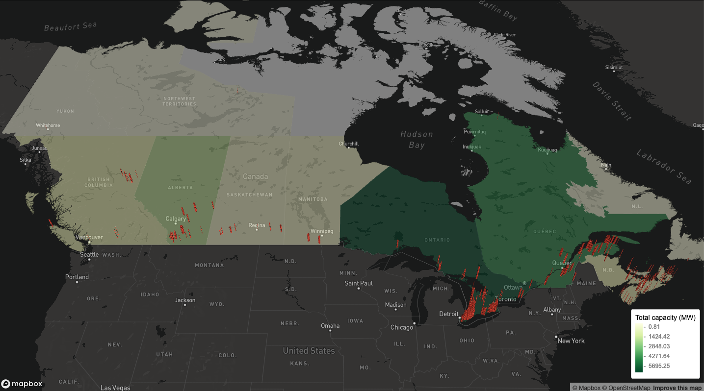
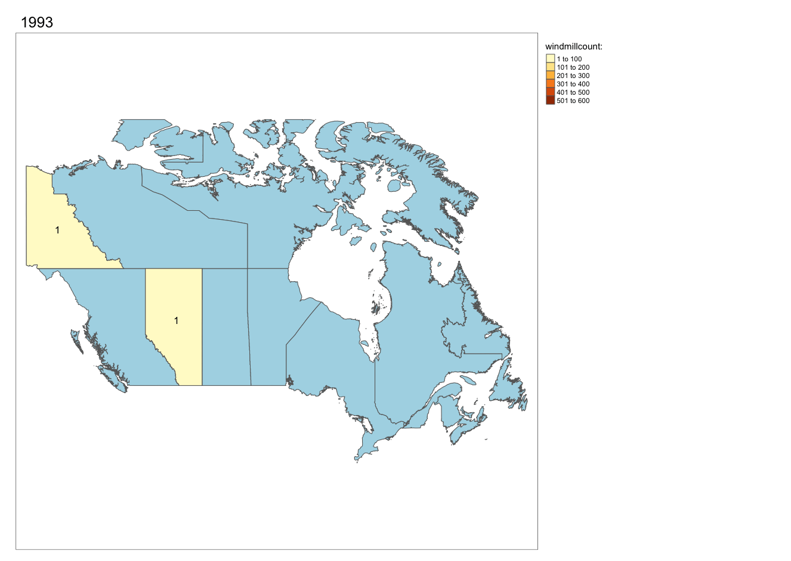

```{r setup, include=FALSE}
knitr::opts_chunk$set(echo = TRUE, warning = FALSE, message = FALSE)
library(fontawesome) # for knitting, install with devtools::install_github("rstudio/fontawesome")
```
# TidyTuesday 2020-10-27

If you want to join the next CorrelAid TidyTuesday Meetup, make sure to sign up to our [Newsletter](https://correlaid.us12.list-manage.com/subscribe?u=b294bf2834adf5d89bdd2dd5a&id=915f3f3eff) or reach out to us on [Twitter](https://twitter.com/CorrelAid)!


## Some pre-meetup inspiration and tips & tricks
**By Cédric Scherer** [`r fa("twitter", fill = "#1da1f2")`](https://twitter.com/CedScherer)

```{r Load, message=FALSE, warning=FALSE}
library(tidyverse)
library(tidytuesdayR)
library(ragg)

theme_set(theme_minimal(base_family = "Roboto Condensed"))

tt <- tt_load("2020-10-27")
df_wind <- tt$`wind-turbine`
```

You can quickly build a bar plot with `geom_bar(aes(x))`:

```{r fig.width = 9, fig.height = 6}
ggplot(df_wind, aes(x = province_territory)) +
  geom_bar() +
  coord_flip()
```

Actually I prefer to caclulate the summaries first, then one uses `geom_col(aes(x, y))`. One good thing about it: You can easily sort the bars in an increasing order for better readability:

```{r fig.width = 9, fig.height = 6}
df_wind %>% 
  count(province_territory) %>% 
  ggplot(aes(forcats::fct_reorder(province_territory, n), n)) +
  geom_col() +
  coord_flip()
```

This way, one can also quickly filter by the number of wind turbines to focus on the most comon categories:

```{r fig.width = 9, fig.height = 6}
df_wind %>% 
  count(project_name) %>% 
  filter(n > 50) %>% 
  ggplot(aes(forcats::fct_reorder(project_name, n), n)) +
  geom_col() +
  coord_flip()
```

If you want to produce a map, turn the dataframe into an spatial object (preferably an `sf` object) and plot it afterwards with `geom_sf()`. Note that you don't need to specify `x` and `y`—ggplot's `geom_sf()` wnows that the coords are what it needs to plot. 

Why not simply plot longitude versus latitude? Yes, you can do that but if you want to add a map underneath it needs to hvae the same projection, otherwise your points will not match with the map. Turning the data into a spatial object allows to reproject (change the projection of/transform) the data, e.g. into the [Lambert Conformal Conic projection](https://proj.org/operations/projections/lcc.html) that is often used for Canada and the US:

```{r}
library(sf)

sf_wind <- 
  df_wind %>% 
  st_as_sf(coords = c("longitude", "latitude"), 
           crs = "+proj=longlat +datum=WGS84 +no_defs") %>% 
  st_transform(crs = "+proj=lcc +lon_0=-90 +lat_1=33 +lat_2=45")

sf_canada <-
  rnaturalearth::ne_countries(scale = 110, country = "Canada", 
                              returnclass = "sf") %>% 
  st_transform(crs = st_crs(sf_wind))

ggplot(sf_canada) +
  geom_sf(color = NA, fill = "grey92") +
  geom_sf(data = sf_wind, color = "#1D994E", alpha = .1, 
          size = 2, shape = 21, fill = NA)
```

Density maps are a quick solution to deal with oveprlotting (as it's the case here). It is very simple to make a hex-bin density map in one line with `geom_hex()`:

```{r}
ggplot(df_wind, aes(longitude, latitude)) +
  geom_hex()
```

### Tips'n'Tricks:

* `GGally::ggpairs()` for a quick EDA
* `rnaturalearth::ne_countries()` and `rnaturalearth::ne_states()` for shape files of countries
* `{ggforce}` package for many many cool things in ggplot2
* `forcats::fct_reorder()` and `forcats::fct_lump()` to reorder factors based on variables or merge those of low interest into a "other" class
* `theme(plot.title.position = "plot", plot.caption.position = "plot")` since `{ggplot2}` v3.0.0 to justify the title, subtitle and caption with the plot area not the panel border
* [Type sorted list of color palettes in R](https://github.com/EmilHvitfeldt/r-color-palettes/blob/master/type-sorted-palettes.md#qualitative-color-palettes)

## A beautiful viz integrating data _and_ the canadian flag 
**By Cédric Scherer** [`r fa("twitter", fill = "#1da1f2")`](https://twitter.com/CedScherer)

You can find the code on [Cédrics GitHub](https://github.com/Z3tt/TidyTuesday/blob/master/R/2020_44_CanadianWindTurbines.Rmd).
<blockquote class="twitter-tweet"><p lang="en" dir="ltr"><a href="https://twitter.com/hashtag/TidyTuesday?src=hash&amp;ref_src=twsrc%5Etfw">#TidyTuesday</a> Week 2020/44 🇨🇦 Wind Turbines in <a href="https://twitter.com/Canada?ref_src=twsrc%5Etfw">@Canada</a> <br><br>I like <a href="https://twitter.com/hashtag/maps?src=hash&amp;ref_src=twsrc%5Etfw">#maps</a>.<br>I like <a href="https://twitter.com/hashtag/flags?src=hash&amp;ref_src=twsrc%5Etfw">#flags</a>.<a href="https://twitter.com/hashtag/r4ds?src=hash&amp;ref_src=twsrc%5Etfw">#r4ds</a> <a href="https://twitter.com/hashtag/rstats?src=hash&amp;ref_src=twsrc%5Etfw">#rstats</a> <a href="https://twitter.com/hashtag/tidyverse?src=hash&amp;ref_src=twsrc%5Etfw">#tidyverse</a> <a href="https://twitter.com/hashtag/rspatial?src=hash&amp;ref_src=twsrc%5Etfw">#rspatial</a> <a href="https://twitter.com/hashtag/mapping?src=hash&amp;ref_src=twsrc%5Etfw">#mapping</a> <a href="https://twitter.com/hashtag/dataviz?src=hash&amp;ref_src=twsrc%5Etfw">#dataviz</a> <a href="https://twitter.com/hashtag/datavis?src=hash&amp;ref_src=twsrc%5Etfw">#datavis</a> <a href="https://twitter.com/hashtag/DataVisualization?src=hash&amp;ref_src=twsrc%5Etfw">#DataVisualization</a> <a href="https://t.co/M7zS2DqeHj">pic.twitter.com/M7zS2DqeHj</a></p>&mdash; Cédric Scherer (@CedScherer) <a href="https://twitter.com/CedScherer/status/1321441341692366848?ref_src=twsrc%5Etfw">October 28, 2020</a></blockquote> <script async src="https://platform.twitter.com/widgets.js" charset="utf-8"></script> 


## An animation showing the turbines being built over the years
**By Long Nguyen**  [`r fa("twitter", fill = "#1da1f2")`](https://twitter.com/long39ng)

```{r message=FALSE, warning=FALSE}
library(tidyverse)
library(sf)
library(rnaturalearth)
library(gganimate)
library(rgeos)
library(rnaturalearthhires) # install with devtools::install_github("ropensci/rnaturalearthhires")
wind_turbine <- readr::read_csv('https://raw.githubusercontent.com/rfordatascience/tidytuesday/master/data/2020/2020-10-27/wind-turbine.csv')
```

```{r}

wind_turbine_welp <- wind_turbine %>% 
  mutate(commissioning_date_welp = str_sub(commissioning_date, end = 4) %>% 
           as.integer())
anim_turbines <- ne_states("Canada", returnclass = "sf") %>% 
  ggplot() +
  geom_sf(colour = "#f8f8f8") +
  geom_jitter(data = wind_turbine_welp,
              aes(longitude, latitude, colour = turbine_rated_capacity_k_w,
                  group = seq_along(objectid)),
              alpha = .4, size = 2.5) +
  scale_colour_viridis_c(
    begin = .3, end = .95, direction = -1,
    labels = function(x) paste(x, "kW"),
    guide = guide_legend(override.aes = list(alpha = 1, size = 2.5))
  ) +
  labs(title = "Wind turbines in Canada",
       subtitle = "Year: {frame_along}") +
  theme_void(base_family = "Asap Condensed", base_size = 16) +
  theme(legend.position = "bottom", legend.title = element_blank()) +
  transition_reveal(commissioning_date_welp)
# animate(anim_turbines, end_pause = 6, width = 600, height = 600, units = "px") # commented out for knitting 
# gganimate::anim_save(here::here("2020-10-27/wind_turbines_over_years.gif")) # commented out for knitting 


```


## Number of wind turbines in the three most-wind-focused provinces
**By Lisa Reiber** [`r fa("twitter", fill = "#1da1f2")`](https://twitter.com/lisa_reiber)

```{r message=FALSE}
library(tidyverse)
library(ggplot2)
library(emoGG)
witu <- readr::read_csv('https://raw.githubusercontent.com/rfordatascience/tidytuesday/master/data/2020/2020-10-27/wind-turbine.csv')
```

```{r fig.height=10}
witu %>% 
      drop_na(project_name) %>% 
      drop_na(province_territory) %>% 
      count(project_name, province_territory) %>% 
      mutate(project_name_f = fct_reorder(project_name, n),
             project_name_trunc = fct_lump_min(project_name_f, min = 50, w = n),
             province_trunc = fct_collapse(province_territory,
                                           Ontario = "Ontario",
                                           Quebec = "Quebec",
                                           Alberta = "Alberta",
                                           other_level = "All Other Provinces")
             ) %>% 
      filter(n > 15) %>% 
      ggplot(aes(project_name_f, n, group = province_trunc, label = project_name)) + 
      geom_col(width = 0.3) +
      emoGG::geom_emoji(emoji = "1f341") + #canada leaf
      facet_grid(province_trunc ~.,
                 scales = "free_x", 
                 space = "free", 
                 switch = "y"
                 ) +
      theme_light() +
      theme(plot.title.position = "plot", #so cool <3
            axis.text.x = element_blank(),
            axis.ticks.x = element_blank(),
            panel.grid.major = element_blank()
            ) +
      labs(y = "",
           x = "",
           title = "Comparing Wind-Turbine Projects in Alberta, Ontario and Quebec to the rest of Canada",
           subtitle = "for projects with more than 15 turbines"
           ) +
      scale_fill_grey() +
      scale_y_continuous(expand = c(0, 0))
      NULL
```

## An interactive map with 3D wind turbines 
**By Frie Preu** [`r fa("twitter", fill = "#1da1f2")`](https://twitter.com/ameisen_strasse)

```{r warning=FALSE, message=FALSE}
library(tidytuesdayR)
library(sf)
library(tidyverse)
library(mapdeck)

key <- Sys.getenv("MAPBOX_TOKEN") # you can create a mapbox token for free after registering at https://www.mapbox.com/

tt <- tt_load("2020-10-27")
turbines <- tt$`wind-turbine`
```

<details><summary><span style="color:#159957;">Click here for the data processing code</span></summary>


#### Create tooltip to use later 
```{r tooltip-turbines}
# tooltip for turbines
turbines <- turbines %>% 
  mutate(tooltip = glue::glue("{turbine_identifier}: commissioned {commissioning_date} as part of project {project_name} \n Hub height (m): {hub_height_m} \n Rotor diameter (m): {rotor_diameter_m} \n capacity: {turbine_rated_capacity_k_w} kw"))
```


#### Load shapefiles from Canadian Open Data Portal

```{r load-spatial}
# uncomment the following lines to download and unzip 
# url <- "http://www12.statcan.gc.ca/census-recensement/2011/geo/bound-limit/files-fichiers/gpr_000b11a_e.zip"
# download.file(url, destfile = here::here("2020-10-27/canada.zip"))
# unzip(here::here("2020-10-27/canada.zip"), exdir = here::here("2020-10-27/canada_shp"))

canada <- sf::read_sf(here::here("2020-10-27/canada_shp/"))
turbines_sf <- sf::st_as_sf(turbines, coords = c("longitude", "latitude"), crs = 4269)
```


#### Calculate province level stats
```{r calculate-province-stats}
# this could probably be one pipe but for easier understandability they are two :) 
# total capacity (project) by province
province_capacities <- turbines %>% 
  group_by(project_name) %>% 
  mutate(capacity = mean(total_project_capacity_mw)) %>% 
  distinct(province_territory, project_name, capacity) %>% # dirty
  group_by(province_territory) %>% 
  summarize(sum_capacity = round(sum(capacity), 2))

# number of turbines and number of projects
province_ns <- turbines %>% 
  group_by(province_territory) %>% 
  summarize(n_projects = n_distinct(project_name),
         n_turbines = n())

# join the two datasets
province_data <- left_join(province_ns, province_capacities, by = "province_territory")

# create tooltip that is later used in mapdeck
province_data <- province_data %>% 
  mutate(tooltip = glue::glue("{province_territory}: &#013;&#010; #turbines: {n_turbines} &#013;&#010; #projects: {n_projects} &#013;&#010; total project capacity (MW): {sum_capacity}"))
```

#### Join spatial datasets with calculated data

```{r join-province-stats-to-spatial}
# this could probably be done way more elegantly with better knowledge of sf!
# join the data to the spatial file, and then join the polygons with the points
turbines_sf <- left_join(turbines_sf, province_data, by = "province_territory")
canada_turbines <- sf::st_join(turbines_sf, canada)

# "aggregate" turbine spatial data to get the PRUID and province_territory variables in a province level dataset 
sum(is.na(canada_turbines$PRUID)) # 4 turbines are not associated to a polygon
province_data_with_uid <- canada_turbines %>% 
  filter(!is.na(PRUID)) %>% 
  st_drop_geometry() %>% 
  distinct(PRUID, province_territory, n_projects, n_turbines, sum_capacity)

# join the province data with the province_territory and the data to the spatial canada data
canada <- left_join(canada, province_data_with_uid, by = "PRUID")

# create tooltip for provinces
canada <- canada %>% 
  mutate(tooltip = glue::glue("{province_territory}: &#013;&#010; #turbines: {n_turbines} &#013;&#010; #projects: {n_projects} &#013;&#010; total project capacity (MW): {sum_capacity}"))
```
</details>

#### Mapdeck!

```{r}
m <- mapdeck(token = key, style = mapdeck_style("dark"), pitch = 45 ) %>%
  add_polygon(
    data = canada,
    fill_colour = "sum_capacity",
    fill_opacity = 0.4,
    tooltip = "tooltip",
    palette = "ylgn",
    layer_id = "provinces",
    legend = TRUE,
    legend_options = list(
            fill_colour = list( title = "Total capacity (MW)"))
  ) %>% 
  add_column(
    data = canada_turbines, 
    lat = "latitude",
    lon = "longitude",
    fill_colour = "#C0392BFF",
    elevation = "hub_height_m",
    elevation_scale = 1000,
    layer_id = "turbines",
    tooltip = "tooltip"
  )
# m # commented out for knitting
```

[](https://tidytuesday.correlaid.org/2020-10-27/canada_wind_power.html)

The **interactive version** of the map can be found [here](https://tidytuesday.correlaid.org/2020-10-27/canada_wind_power.html)

## A (WIP) animation of newly added wind turbines over the years
**By Andreas Neumann**
<details><summary><span style="color:#159957;">Click here for the data processing code</span></summary>

```{r}
library(downloader)
library(tmap)
library(sf)
###data wind turbines###
Wind_Turbine_Database_FGP <- readr::read_csv('https://raw.githubusercontent.com/rfordatascience/tidytuesday/master/data/2020/2020-10-27/wind-turbine.csv')

names(Wind_Turbine_Database_FGP)[2] <- "territory"
names(Wind_Turbine_Database_FGP)[12] <- "year"

Wind_Turbine_Database_FGP$year <- as.numeric(Wind_Turbine_Database_FGP$year)
df <- Wind_Turbine_Database_FGP %>%
  dplyr::group_by(territory, year) %>%
  dplyr::summarise(Freq = n())

###add territories and provinces####
# uncomment the following lines to download and unzip
# url <- "https://download2.exploratory.io/maps/canada_provinces.zip"
# download(url, dest = here::here("2020-10-27/canada_provinces.zip"), mode = "wb")
# unzip("canada_provinces.zip", exdir = "canada_provinces")
canada <- sf::st_read("canada_provinces/canada_provinces/canada_provinces.geojson")
names(canada)[3] <- "territory"
###Merge the data and create maps###
canadaturbines <- merge(df, canada, by = "territory")
carto <- st_as_sf(x = canadaturbines,
                  crs = "+datum=WGS84")
carto_norm = carto %>%
  split(.$year) %>%
  do.call(rbind, .)


```
</details>
```{r}
anim_can = tm_shape(canada) + tm_polygons(col = "lightblue") + tm_shape(carto_norm) +
  tm_polygons("Freq", title = "windmillcount: ") +
  tm_facets(along = "year",
            free.coords = FALSE,
            drop.units = TRUE) +
  tm_layout(legend.outside.position = "right",
            legend.outside = TRUE) + tm_text("Freq")
# tmap_animation(
#   anim_can,
#   filename = here::here("2020-10-27/canadawindnr3.gif"),
#   delay = 150,
#   width = 1326,
#   height = 942
# ) # commented out for knitting

```


## Do manufactureres have a province "preference"?
**By Sylvi Rzepka**

```{r}
library(ggplot2)
library(dplyr)
library(viridis)
wind2 <- wind_turbine %>%
  filter(
    province_territory == "Alberta" |
      province_territory == "Ontario" |
      province_territory == "Quebec"
  ) %>%
  mutate(manufacturer_fct = as.factor(manufacturer)) %>%
  mutate(manufacturer_fct_o = fct_lump_min(manufacturer_fct, 19)) %>%
  count(province_territory, manufacturer_fct_o)


ggplot(wind2,
         aes(fill = manufacturer_fct_o, x = n, y = province_territory)) +
  geom_bar(stat = "identity") +
  labs(
    x = NULL,
    y = "Province",
    color = NULL,
    title = "Manufacturers by Province"
  ) +
  scale_fill_viridis(discrete = T, direction = -1) +
  theme_minimal() +
  theme(legend.title = element_blank(),
        legend.position = "bottom")
```

## A classic bar plot 
**By Daniela Vogler**
```{r message=FALSE, warning=FALSE}
library(dplyr)
library(ggplot2)
library(stringr)
wind_turbine <- readr::read_csv('https://raw.githubusercontent.com/rfordatascience/tidytuesday/master/data/2020/2020-10-27/wind-turbine.csv')
```

```{r barplot-daniela}
wt_height <- wind_turbine  %>%
  mutate(commissioning_date = as.numeric(str_sub(commissioning_date, start=1, end=4))) %>%
  group_by(commissioning_date) %>%
  summarize(avg_hub_height = mean(hub_height_m))
ggplot(wt_height) +
  geom_col(aes(x = commissioning_date, y = avg_hub_height)) +
  labs(title = "Height of Wind Turbines", x = "Year", y = "Average Height (m)") +
  theme_classic()

```

## A colorful scatterplot
**By Heba Azzam** [`r fa("twitter", fill = "#1da1f2")`](https://twitter.com/hebaa_azzam)
```{r message=FALSE, warning=FALSE}
library(ggplot2)
wind_turbine <- readr::read_csv('https://raw.githubusercontent.com/rfordatascience/tidytuesday/master/data/2020/2020-10-27/wind-turbine.csv')
```

```{r plot-heba}

wind_turbine %>% ggplot(aes(x= rotor_diameter_m, y= hub_height_m, color= province_territory)) +
  geom_point(size=6, alpha=0.9, shape=16)+theme(legend.position = "bottom")  +
  labs(
    title = "Turbines models",
    x = "rotor_diameter_m",
    y = "hub_height_m" )
```

