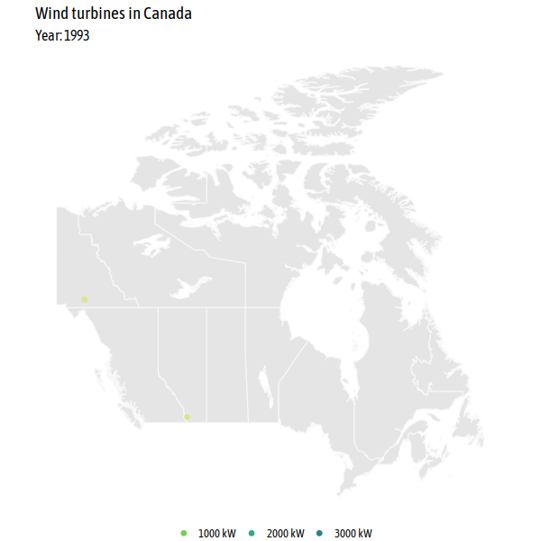

```{r setup, include=FALSE}
knitr::opts_chunk$set(echo = TRUE)
library(fontawesome) # for knitting, install with devtools::install_github("rstudio/fontawesome")
```
# TidyTuesday 2020-10-27

If you want to join the next CorrelAid TidyTuesday Meetup, make sure to sign up to our [Newsletter](https://correlaid.us12.list-manage.com/subscribe?u=b294bf2834adf5d89bdd2dd5a&id=915f3f3eff) or reach out to us on [Twitter](https://twitter.com/CorrelAid)!


## Some pre-meetup inspiration and tips & tricks
**By Cédric Scherer** [`r fa("twitter", fill = "#1da1f2")`](https://twitter.com/CedScherer)

```{r Load, message=FALSE, warning=FALSE}
library(tidyverse)
library(tidytuesdayR)
library(ragg)
library(sf)
library(ggplot2)
theme_set(theme_minimal(base_family = "Roboto Condensed"))
tt <- tt_load("2020-10-27")
df_wind <- tt$`wind-turbine`
```


```{r fig.width = 9, fig.height = 6}

ggplot(df_wind, aes(x = province_territory)) +
  geom_bar() +
  coord_flip()

df_wind %>% 
  count(province_territory) %>% 
  ggplot(aes(forcats::fct_reorder(province_territory, n), n)) +
  geom_col() +
  coord_flip()

df_wind %>% 
  count(project_name) %>% 
  filter(n > 50) %>% 
  ggplot(aes(forcats::fct_reorder(project_name, n), n)) +
  geom_col() +
  coord_flip()
```

```{r}
sf_wind <- 
  df_wind %>% 
  st_as_sf(coords = c("longitude", "latitude"), 
           crs = "+proj=longlat +datum=WGS84 +no_defs") %>% 
  st_transform(crs = "+proj=lcc +lon_0=-90 +lat_1=33 +lat_2=45")

sf_canada <-
  rnaturalearth::ne_countries(scale = 110, country = "Canada", 
                              returnclass = "sf") %>% 
  st_transform(crs = st_crs(sf_wind))

ggplot(sf_canada) +
  geom_sf(color = NA, fill = "grey92") +
  geom_sf(data = sf_wind, color = "#1D994E", alpha = .1, 
          size = 2, shape = 21, fill = NA)

ggplot(df_wind, aes(longitude, latitude)) +
  geom_hex()
```

**Tips'n'Tricks:**

* `GGally::ggpairs()` for a quick EDA
* `rnaturalearth::ne_countries()` and `rnaturalearth::ne_states()` for shape files of countries
* `{ggforce}` package for many many cool things in ggplot2
* `forcats::fct_reorder()` and `forcats::fct_lump()` to reorder factors based on variables or merge those of low interest into a "other" class
* `theme(plot.title.position = "plot", plot.caption.position = "plot")` since `{ggplot2}` v3.0.0 to justify the title, subtitle and caption with the plot area not the panel border
* [Type sorted list of color palettes in R](https://github.com/EmilHvitfeldt/r-color-palettes/blob/master/type-sorted-palettes.md#qualitative-color-palettes)

## An animation
**By Long Nguyen**  [`r fa("twitter", fill = "#1da1f2")`](https://twitter.com/long39ng)

```{r message=FALSE, warning=FALSE}
library(tidyverse)
library(sf)
library(rnaturalearth)
library(gganimate)
library(rgeos)
library(rnaturalearthhires) # install with devtools::install_github("ropensci/rnaturalearthhires")
wind_turbine <- readr::read_csv('https://raw.githubusercontent.com/rfordatascience/tidytuesday/master/data/2020/2020-10-27/wind-turbine.csv')
```

```{r}

wind_turbine_welp <- wind_turbine %>% 
  mutate(commissioning_date_welp = str_sub(commissioning_date, end = 4) %>% 
           as.integer())
anim_turbines <- ne_states("Canada", returnclass = "sf") %>% 
  ggplot() +
  geom_sf(colour = "#f8f8f8") +
  geom_jitter(data = wind_turbine_welp,
              aes(longitude, latitude, colour = turbine_rated_capacity_k_w,
                  group = seq_along(objectid)),
              alpha = .4, size = 2.5) +
  scale_colour_viridis_c(
    begin = .3, end = .95, direction = -1,
    labels = function(x) paste(x, "kW"),
    guide = guide_legend(override.aes = list(alpha = 1, size = 2.5))
  ) +
  labs(title = "Wind turbines in Canada",
       subtitle = "Year: {frame_along}") +
  theme_void(base_family = "Asap Condensed", base_size = 16) +
  theme(legend.position = "bottom", legend.title = element_blank()) +
  transition_reveal(commissioning_date_welp)
# animate(anim_turbines, end_pause = 6, width = 600, height = 600, units = "px") # commented out for knitting 
# gganimate::anim_save(here::here("2020-10-27/wind_turbines_over_years.gif")) # commented out for knitting 


```


## An interactive map with 3D wind turbines 
**By Frie Preu** [`r fa("twitter", fill = "#1da1f2")`](https://twitter.com/ameisen_strasse)

```{r warning=FALSE, message=FALSE}
library(tidytuesdayR)
library(sf)
library(tidyverse)
library(mapdeck)

key <- Sys.getenv("MAPBOX_TOKEN") # you can create a mapbox token for free after registering at https://www.mapbox.com/

tt <- tt_load("2020-10-27")
turbines <- tt$`wind-turbine`
```

#### Create tooltip to use later 
```{r tooltip-turbines}
# tooltip for turbines
turbines <- turbines %>% 
  mutate(tooltip = glue::glue("{turbine_identifier}: commissioned {commissioning_date} as part of project {project_name} \n Hub height (m): {hub_height_m} \n Rotor diameter (m): {rotor_diameter_m} \n capacity: {turbine_rated_capacity_k_w} kw"))
```


#### Load shapefiles from Canadian Open Data Portal

```{r load-spatial}
# download from https://open.canada.ca/data/en/dataset/bab06e04-e6d0-41f1-a595-6cff4d71bedf
# and unzip 
canada <- sf::read_sf("gpr_000b11a_e/")
turbines_sf <- sf::st_as_sf(turbines, coords = c("longitude", "latitude"), crs = 4269)
```


#### Calculate province level stats
```{r calculate-province-stats}
# this could probably be one pipe but for easier understandability they are two :) 
# total capacity (project) by province
province_capacities <- turbines %>% 
  group_by(project_name) %>% 
  mutate(capacity = mean(total_project_capacity_mw)) %>% 
  distinct(province_territory, project_name, capacity) %>% # dirty
  group_by(province_territory) %>% 
  summarize(sum_capacity = round(sum(capacity), 2))

# number of turbines and number of projects
province_ns <- turbines %>% 
  group_by(province_territory) %>% 
  summarize(n_projects = n_distinct(project_name),
         n_turbines = n())

# join the two datasets
province_data <- left_join(province_ns, province_capacities, by = "province_territory")

# create tooltip that is later used in mapdeck
province_data <- province_data %>% 
  mutate(tooltip = glue::glue("{province_territory}: &#013;&#010; #turbines: {n_turbines} &#013;&#010; #projects: {n_projects} &#013;&#010; total project capacity (MW): {sum_capacity}"))
```

#### Join spatial datasets with calculated data

```{r join-province-stats-to-spatial}
# this could probably be done way more elegantly with better knowledge of sf!
# join the data to the spatial file, and then join the polygons with the points
turbines_sf <- left_join(turbines_sf, province_data, by = "province_territory")
canada_turbines <- sf::st_join(turbines_sf, canada)

# "aggregate" turbine spatial data to get the PRUID and province_territory variables in a province level dataset 
sum(is.na(canada_turbines$PRUID)) # 4 turbines are not associated to a polygon
province_data_with_uid <- canada_turbines %>% 
  filter(!is.na(PRUID)) %>% 
  st_drop_geometry() %>% 
  distinct(PRUID, province_territory, n_projects, n_turbines, sum_capacity)

# join the province data with the province_territory and the data to the spatial canada data
canada <- left_join(canada, province_data_with_uid, by = "PRUID")

# create tooltip for provinces
canada <- canada %>% 
  mutate(tooltip = glue::glue("{province_territory}: &#013;&#010; #turbines: {n_turbines} &#013;&#010; #projects: {n_projects} &#013;&#010; total project capacity (MW): {sum_capacity}"))
```

#### Mapdeck!

```{r}
m <- mapdeck(token = key, style = mapdeck_style("dark"), pitch = 45 ) %>%
  add_polygon(
    data = canada,
    fill_colour = "sum_capacity",
    fill_opacity = 0.4,
    tooltip = "tooltip",
    palette = "ylgn",
    layer_id = "provinces",
    legend = TRUE,
    legend_options = list(
            fill_colour = list( title = "Total capacity (MW)"))
  ) %>% 
  add_column(
    data = canada_turbines, 
    lat = "latitude",
    lon = "longitude",
    fill_colour = "#C0392BFF",
    elevation = "hub_height_m",
    elevation_scale = 1000,
    layer_id = "turbines",
    tooltip = "tooltip"
  )
m
```
