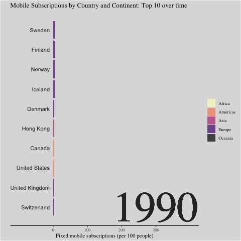
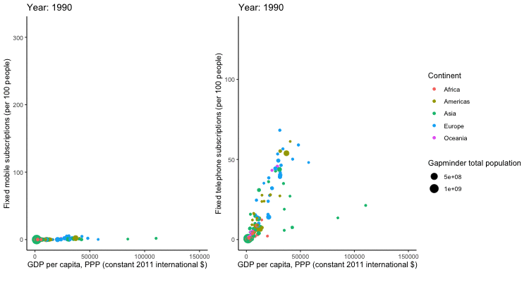

```{r setup, include=FALSE}
knitr::opts_chunk$set(echo = TRUE, warning = FALSE, fig.showtext = T, fig.retina = 1)
library(fontawesome)
library(tidytuesdayR)
```

This week at the CorrelAid #TidyTuesday coding hangout, it was Gif Galore!!

But let's first look at the great static contributions of this week! 

## Static No. 1 
**By Thomas**

```{r thomas-setup, message=FALSE}
library(tidyverse)
library(ggplot2)
library(data.table)
library(lsr)
tuesdata <- tidytuesdayR::tt_load('2020-11-10')
mobile <- tuesdata$mobile
landline <- tuesdata$land
```

```{r thomas, message=FALSE}
mobile <- mobile[complete.cases(mobile), ]
landline <- landline[complete.cases(landline), ]
landline$mode <- "landline"
mobile$mode <- "mobile"
colnames(mobile)[colnames(mobile)=="mobile_subs"] <- "subs"
colnames(landline)[colnames(landline)=="landline_subs"] <- "subs"
combined <- rbind(landline, mobile)
setDT(combined)
combined[,gdp_cat:= lsr::quantileCut(log(gdp_per_cap),5)]

ggplot(combined, aes(x=year, y=subs, color=as.factor(gdp_cat))) +
  geom_smooth(method = "gam", formula = y ~ s(x, bs = "cs"), se = FALSE) +
  scale_color_brewer(palette="YlOrBr", name = "log GDP per capita \n", labels = c("20th quintile", "40th quintile", "60th quintile", "80th quintile", "100th quintile")) +
  labs(title = "Subscriptions by mode, year and GDP (conditional means)\n", x = "Year", y = "Subscriptions in the population (per 100 people)") +
  theme_dark() +
  theme(panel.background = element_rect("grey74"), 
        panel.grid.major = element_line(size = 0.25, linetype = 'solid', colour = "grey64"), 
        panel.grid.minor = element_line(size = 0.25, linetype = 'solid', colour = "grey74"), 
        plot.title = element_text(hjust = 0.5),
        legend.key = element_rect(fill = "grey74")) +
  facet_wrap(~mode, scales = "free_y") +
  scale_x_continuous(breaks = seq(1990, 2020, by = 5), limits = c(1990, 2020)) +
  scale_y_continuous(breaks = seq(0, 125, by = 25), limits = c(0, 130))
```

## Static No. 2
**By Sylvi Rzepka**

```{r sylvi-setup, message=FALSE}
library(tidytuesdayR)
library(ggplot2)
library(ggtext)
library(ggridges)
library(ggplot2)
library(viridis)
library(tidyverse)
tuesdata <- tidytuesdayR::tt_load('2020-11-10')
mobile <- tuesdata$mobile

```

```{r sylvi}
#Prep
mobile_afreuro<-mobile %>%
  filter(continent %in% c("Africa","Europe") & year %in% c(1990,1995,2000,2005, 2010, 2016)) %>%
  #orginal data: per 100 -- dividing by 100 to make a per person figure out of it.
  mutate(mobile_pp=mobile_subs/100) %>%
  select(code, continent, year, mobile_pp)%>%
  pivot_longer(cols=continent)
#Summary
mobile_afreuro%>%
          group_by(value, year ) %>%
          summarise(
          q10=quantile(mobile_pp,probs=(.1), na.rm=TRUE),
          q25=quantile(mobile_pp,probs=(.25), na.rm=TRUE),
          median=median(mobile_pp, na.rm=TRUE),
          q70=quantile(mobile_pp,probs=(.7), na.rm=TRUE),
          q75=quantile(mobile_pp,probs=(.75), na.rm=TRUE))
#Plotting
plot5<-ggplot(mobile_afreuro, aes(x =mobile_pp , y =  as.factor(year), fill = as.factor(year))) +
  geom_density_ridges(alpha=0.6) +
  scale_fill_viridis(discrete=TRUE) +
  scale_color_viridis(discrete=TRUE) +
  theme_ridges() +
  facet_wrap(~value) + # and country?
# edit the theme
theme(text = element_text(family = "Andale Mono"), legend.position = "none", # change all text font and move the legend to the bottom
      panel.grid = element_line(color="white"),  # change the grid color and remove minor y axis lines
      plot.caption = element_text(hjust = 0.5, size = 8, color = "#29AF7FFF"), # remove x-axis text and edit the caption (centered and brown)
      strip.background = element_rect(colour="white", fill="#FFFFFF"), # removing the gray facet_wrap box
      plot.title = element_text(size = 24), plot.subtitle = element_markdown(size=9, family = "Helvetica", color = "#29AF7FFF")) +# make the title bigger and edit the subtitle (font)
  # title
  labs(title = "Call me mobile",
       subtitle = "In 2016, 30% of Africans and 90% of Europeans have at least one mobile phone subscription.  ",
       x = "Number of subscriptions per person", y=NULL,
       caption = "data from OurWorldInData.org")
plot5
#ggsave("callMeMobile3.png")
```

## Static No. 3
**By Cédric Scherer**


Code on [GitHub](https://github.com/Z3tt/TidyTuesday/blob/master/R/2020_46_HistoricalPhones.Rmd)

<blockquote class="twitter-tweet"><p lang="en" dir="ltr"><a href="https://twitter.com/hashtag/TidyTuesday?src=hash&amp;ref_src=twsrc%5Etfw">#TidyTuesday</a> Week 2020/46 📱 Mobile Phone Subscriptions<br><br>An area chart showing mobile subscriptions per 100 people by continent and region over time. Data by <a href="https://twitter.com/OurWorldInData?ref_src=twsrc%5Etfw">@OurWorldInData</a>.<br> <a href="https://twitter.com/hashtag/rstats?src=hash&amp;ref_src=twsrc%5Etfw">#rstats</a> <a href="https://twitter.com/hashtag/ggplot2?src=hash&amp;ref_src=twsrc%5Etfw">#ggplot2</a> <a href="https://twitter.com/hashtag/tidyverse?src=hash&amp;ref_src=twsrc%5Etfw">#tidyverse</a> <a href="https://twitter.com/hashtag/r4ds?src=hash&amp;ref_src=twsrc%5Etfw">#r4ds</a> <a href="https://twitter.com/hashtag/dataviz?src=hash&amp;ref_src=twsrc%5Etfw">#dataviz</a> <a href="https://twitter.com/hashtag/daatviz?src=hash&amp;ref_src=twsrc%5Etfw">#daatviz</a> <a href="https://t.co/GRgOrwiZHK">pic.twitter.com/GRgOrwiZHK</a></p>&mdash; Cédric Scherer (@CedScherer) <a href="https://twitter.com/CedScherer/status/1327026541675614208?ref_src=twsrc%5Etfw">November 12, 2020</a></blockquote> <script async src="https://platform.twitter.com/widgets.js" charset="utf-8"></script> 


Now, let's hop on the Gif train! `r emo::ji("steam_locomotive")` `r emo::ji("steam_locomotive")` `r emo::ji("steam_locomotive")`


## Gif No. 1  
**By Long Nguyen**  [`r fa("twitter", fill = "#1da1f2")`](https://twitter.com/long39ng)


```{r long, eval=FALSE}
library(tidyverse)
library(colorspace)
library(patchwork)
library(magick)
library(ggtext)
theme_set(
  theme_minimal() +
    theme(axis.text = element_text(family = "Space Mono"),
          panel.grid = element_blank(),
          plot.title = element_text(family = "Space Mono",
                                    face = "bold",
                                    size = rel(1.6)),
          plot.caption = element_markdown(family = "Space Mono",
                                          face = "bold.italic",
                                          hjust = 0))
)
world_map <- rnaturalearth::ne_countries(returnclass = "sf") %>% 
  select(iso_a3, geometry)
map_hist_layout <- c(
  area(1, 1, 13, 14), # Map
  area(12, 8, 13, 11), # Histogram
  area(14, 1, 15, 14) # Slider
)
# # Determine histogram axis limit and number of bins
# mobile %>% 
#   semi_join(world_map, by = c("code" = "iso_a3")) %>% 
#   group_by(year) %>% 
#   slice_max(mobile_subs) %>% 
#   View()
mobile_img <- image_graph(875, 600, res = 96)
mobile_year_list <- group_split(mobile, year)
out <- map(mobile_year_list, function(data) {
  mobile_data <- world_map %>% 
    filter(iso_a3 != "ATA") %>% # Antarctica
    left_join(data %>% 
                select(code, mobile_subs), by = c("iso_a3" = "code"))
  mobile_map <- ggplot(
    mobile_data,
    aes(fill = cut_width(mobile_subs, width = 20, boundary = 0))
  ) +
    geom_sf(colour = "#f8f8f8", size = .25, show.legend = FALSE) +
    coord_sf(label_axes = "----", expand = FALSE,
             crs = "+proj=robin") + # Robinson projection
    scale_fill_discrete_sequential("YlGnBu", na.value = "#cccccc", nmax = 11) +
    theme(plot.margin = margin(0, 0, 0, 0))
  mobile_hist <- ggplot(
    mobile_data,
    aes(mobile_subs, fill = cut_width(mobile_subs, width = 20, boundary = 0))
  ) +
    geom_histogram(binwidth = 20, boundary = 0, show.legend = FALSE) +
    scale_x_continuous(limits = c(0, 220), n.breaks = 12,
                       labels = function(x) {
                         x[seq(2, 12, by = 2)] <- ""
                         x
                       }) +
    scale_fill_discrete_sequential("YlGnBu", nmax = 11) +
    coord_cartesian(expand = FALSE) +
    theme(axis.title.x = element_blank(),
          axis.title.y = element_blank(),
          axis.text.y = element_blank(),
          plot.margin = margin(0, 0, 0, 0))
  year_slider <- ggplot(data = NULL, aes(x = 1990:2017, y = 1)) +
    geom_line(size = 2, colour = "#cccccc") +
    geom_point(aes(x = data$year), shape = 21, size = 4.5, stroke = .6,
               fill = "#f8f8f8", colour = "#26185f") +
    geom_text(aes(x = data$year, y = 1, label = data$year),
              vjust = 1.75, family = "Space Mono") +
    theme_void()
  print(
    mobile_map + mobile_hist + year_slider +
      plot_layout(design = map_hist_layout) +
      plot_annotation(
        title = "Mobile phone subscriptions per 100 people",
        caption = "Source: OurWorldInData.org<br>
                   *Antarctica not included"
      )
  )
})
dev.off()
mobile_anim <- image_animate(mobile_img, fps = 2)
print(mobile_anim)
```
<blockquote class="twitter-tweet"><p lang="en" dir="ltr">Creating visualizations during <a href="https://twitter.com/CorrelAid?ref_src=twsrc%5Etfw">@CorrelAid</a> <a href="https://twitter.com/hashtag/TidyTuesday?src=hash&amp;ref_src=twsrc%5Etfw">#TidyTuesday</a> meetups takes half the time it would otherwise 🚀 Here&#39;s my attempt to spice up an animated choropleth map using this week&#39;s data <a href="https://twitter.com/hashtag/rstats?src=hash&amp;ref_src=twsrc%5Etfw">#rstats</a> <a href="https://twitter.com/hashtag/dataviz?src=hash&amp;ref_src=twsrc%5Etfw">#dataviz</a> <a href="https://t.co/7o82bYxqyt">pic.twitter.com/7o82bYxqyt</a></p>&mdash; Long Nguyen (@long39ng) <a href="https://twitter.com/long39ng/status/1326267609126498305?ref_src=twsrc%5Etfw">November 10, 2020</a></blockquote> <script async src="https://platform.twitter.com/widgets.js" charset="utf-8"></script> 

## Gif No. 2
**By Liam Bailey**  [`r fa("twitter", fill = "#1da1f2")`](https://twitter.com/ldbailey255)


```{r liam-setup, message=FALSE}
#TidyTuesday 2020 week 46
#Load packages
library(rnaturalearth)
library(ggplot2)
library(dplyr)
library(sf)
library(gganimate)
library(rnaturalearthdata)
library(extrafont)
#Phone data
tuesdata <- tidytuesdayR::tt_load(2020, week = 46)
mobile   <- tuesdata$mobile
landline <- tuesdata$landline
```

```{r liam, message=FALSE, warning = FALSE, eval=FALSE}
#Link landline and mobile data by country/year
phone_types <- mobile %>% 
  left_join(select(landline, -total_pop, -gdp_per_cap, -continent), by = c("entity", "code", "year")) %>% 
  #Remove 2016+ because the data becomes patchy after this
  filter(year <= 2015) %>% 
  #Convert NAs into 0s
  mutate(across(ends_with('subs'), .fns = ~tidyr::replace_na(., 0L))) %>% 
  #Determine total number of subscriptions in each year and then determine what % of these are mobile
  mutate(total_subs = mobile_subs + landline_subs,
         perc_mobile = mobile_subs/total_subs) %>% 
  #Remove any countries that have any missing subs data in some years
  group_by(code) %>% 
  filter(all(!is.na(perc_mobile))) %>% 
  ungroup() %>% 
  #When we create our points we don't want any that are truly size 0 (will fail to plot), so we will add a small value
  mutate(perc_mobile = dplyr::case_when(perc_mobile == 0 ~ 0.001,
                                        TRUE ~ perc_mobile))
#Load polygons of the world
world <- rnaturalearth::ne_countries(scale = "medium", returnclass = "sf") %>% 
  #groupby and merge any multiple polygons per country (e.g. Tasmania)
  group_by(iso_a3) %>% 
  summarise()

#For each year, scale based on the percentage of mobile subs
plot_list <- purrr::map_df(.x = seq(min(phone_types$year), max(phone_types$year)),
           .f = function(focal_year){
             #Extract focal countries with data in that year
             countries <- phone_types %>% 
               filter(year == focal_year)
             #Filter world polygons
             world_polygons <- world %>% 
               left_join(select(countries, code, perc_mobile), by = c("iso_a3" = "code")) %>% 
               filter(!is.na(perc_mobile))
             #Extract geometries (need to be separate from data for scaling)
             world_filter <- world_polygons %>% 
               st_geometry()
             #Extract centroids of all polygons
             centroids <- st_centroid(world_filter)
             #Scale geometries relative to the percentage of mobile subscriptions
             #When mobile subs are 100% countries will be at actual size
             world_scaled <- (world_filter - centroids) * world_polygons$perc_mobile + centroids
             #Replace existing geometry with scale geometry
             world_polygons <- world_polygons %>% 
               mutate(geometry = world_scaled,
                      year = focal_year)
             world_polygons
           }) %>% 
  #Fix any broken polygons that prevent plotting
  sf::st_make_valid()
#Create a gganimate plot
animated_plot <- ggplot()+
  #Plot scaled polygons
  geom_sf(data = plot_list, aes(fill = perc_mobile)) +
  #Colour based on mobile subs
  scale_fill_gradientn(colours = paletteer::paletteer_c("grDevices::Blues", n = 100, direction = -1) %>% as.character(),
                                              limits = c(0, 1), name = "") +
  theme_void() +
  theme(legend.text = element_text(family = "Roboto")) +
  #Ensure fixed lat/long range
  scale_x_continuous(limits = c(-180, 180)) +
  scale_y_continuous(limits = c(-90, 90)) +
  labs(x = "", y = "", title = "Proportion of mobile phone subscriptions",
       subtitle = "{current_frame}", caption = "Data: OurWorldInData.org | Map: @ldbailey255") +
  theme(legend.text = element_text(family = "Ubuntu", size = 14),
        plot.title = element_text(family = "Alfa Slab One", size = 25),
        plot.subtitle = element_text(family = "Ubuntu", size = 16),
        plot.caption = element_text(family = "Ubuntu Mono", size = 10)) +
  #Use transition manual rather than transition_time
  #transition_time has problems rendering sf polygons over time (they jump around)
  transition_manual(year) +
  ease_aes("linear")
```
<blockquote class="twitter-tweet"><p lang="en" dir="ltr">Didn&#39;t get to join the <a href="https://twitter.com/CorrelAid?ref_src=twsrc%5Etfw">@CorrelAid</a> <a href="https://twitter.com/hashtag/TidyTuesday?src=hash&amp;ref_src=twsrc%5Etfw">#TidyTuesday</a> call, but still managed jump on the gganimate bandwagon. Wanted to make one of these scaled geographic maps for awhile so played around with polygon transforms in sf. <a href="https://t.co/Z5Nl8T8Xpi">pic.twitter.com/Z5Nl8T8Xpi</a></p>&mdash; Liam Bailey (@ldbailey255) <a href="https://twitter.com/ldbailey255/status/1326326706077052928?ref_src=twsrc%5Etfw">November 11, 2020</a></blockquote> <script async src="https://platform.twitter.com/widgets.js" charset="utf-8"></script> 

## Gif No. 3
**By Lisa Reiber** [`r fa("twitter", fill = "#1da1f2")`](https://twitter.com/lisa_reiber)

```{r lisa-setup, message=FALSE}
pacman::p_load(tidytuesdayR, gganimate, here, tidyverse)
# import data
tt <- tt_load("2020-11-10")
mobile <- tt$mobile
landline <- tt$landline
```

```{r, warning=FALSE}

# make barrace git inspired/based on Based on https://evamaerey.github.io/little_flipbooks_library/racing_bars/racing_barcharts.html#35
ranked_by_year <- mobile %>%  
  select(country = entity, count_obj = mobile_subs, year, continent) %>% 
  #filter(year < 2015, year > 2000, continent %in% c("Europe", "Africa")) %>% 
  # for each year we assign a rank
  group_by(year) %>%  
  arrange(year, -count_obj) %>%  
  # assign ranking
  mutate(rank = 1:n()) %>%  
  filter(rank <= 10) 
# custom theme
my_theme <- theme_classic(base_family = "Times") +
  theme(axis.text.y = element_blank()) +
  theme(axis.ticks.y = element_blank()) +
  theme(axis.line.y = element_blank()) +
  theme(legend.background = element_rect(fill = "gainsboro")) +
  theme(plot.background = element_rect(fill = "gainsboro")) +
  theme(panel.background = element_rect(fill = "gainsboro"))
# static plot
my_plot <- ranked_by_year %>% 
  ggplot() +  
  aes(xmin = 0 ,  
      xmax = count_obj) +  
  aes(ymin = rank - .45,  
      ymax = rank + .45,  
      y = rank) +  
  facet_wrap(~ year) +  
  geom_rect(alpha = .7) +  
  aes(fill = continent) +  
  scale_fill_viridis_d(option = "magma",  
                       direction = -1) +  
  scale_x_continuous(  
    limits = c(-200, 400),  
    breaks = c(0, 100, 200, 300)) +  
  geom_text(col = "gray13",  
            hjust = "right",  
            aes(label = country),  
            x = -10) +  
  scale_y_reverse() +  
  labs(fill = NULL) +  
  labs(x = 'Fixed mobile subscriptions (per 100 people)') +  
  labs(y = "") + 
  labs(title = "Mobile Subscriptions by Country and Continent: Top 10 over time") +
  my_theme
# animated plot
anim_plot <- my_plot +  
  facet_null() +  
  scale_x_continuous(  
    limits = c(-100, 400),  
    breaks = c(0, 100, 200, 300)) +  
  geom_text(x = 300 , y = -10,  
            family = "Times",  
            aes(label = as.character(year)),  
            size = 30, col = "grey18") +  
  aes(group = country) +  
  gganimate::transition_time(year)
# COMMENTED OUT FOR KNITTING 
# save it
#f <- animate(anim_plot, duration = 3, fps  =  200)
#anim_save(f, animation = last_animation(), path = here("barrace"))
#anim_save("mobile_subscriptions_dur3_fsp200.gif")
```



## Gif No. 4
**By Sascha Kuhn**
```{r sascha-setup, message=FALSE}
tuesdata <- tidytuesdayR::tt_load('2020-11-10')
mobile <- tuesdata$mobile
landline <- tuesdata$landline
library(tidyverse)
library(gganimate)
library(gifski)
library(magick)

```

```{r sascha, eval=FALSE, warning=FALSE}
#prep data
mobile_anim <- mobile %>%
  mutate(entity = factor(entity),
         continent = factor(continent),
         gdp_per_cap = round(gdp_per_cap)) %>%
  arrange(entity,year) %>%
  filter(year <= 2014) %>%
# plot
ggplot(aes(gdp_per_cap,mobile_subs, size = total_pop, color = continent, frame = year)) +
  labs(x="GDP per capita, PPP (constant 2011 international $)" , y = "Fixed mobile subscriptions (per 100 people)", size = "Gapminder total population", color = 'Continent', caption = "") +
  geom_point() +
  theme_classic() +
  theme(legend.position = "none") +
  scale_x_continuous(limits=c(100, 150000)) +
# gganimate code
  ggtitle("Year: {round(frame_time,0)}") +
  transition_time(year) +
  ease_aes("cubic-in-out") +
  enter_fade() +
  exit_fade()
#prep data
landline_anim <- landline %>%
  mutate(entity = factor(entity),
         continent = factor(continent)) %>%
  filter(year <= 2014) %>%
#plot
  ggplot(aes(gdp_per_cap,landline_subs, size = total_pop, color = continent, frame = year)) +
  labs(x="GDP per capita, PPP (constant 2011 international $)" , y = "Fixed telephone subscriptions (per 100 people)", size = "Gapminder total population", color = 'Continent', caption = "") +
  geom_point() +
  theme_classic() +
  scale_x_continuous(limits=c(100, 150000)) +
# gganimate code
  ggtitle("Year: {round(frame_time,0)}") +
  transition_time(year) +
  ease_aes("cubic-in-out") +
  enter_fade() +
  exit_fade()

# COMMENTED OUT FOR KNITTING
### render Animations
mobile_render <- animate(mobile_anim, duration = 10, fps = 20, width = 300, height = 400, renderer = gifski_renderer())
landline_render <- animate(landline_anim, duration = 10, fps = 20, width = 450, height = 400, renderer = gifski_renderer())
### Convert to mgif so both can be added into one gif
mobile_mgif <- image_read(mobile_render)
landline_mgif <- image_read(landline_render)
combined_gif <- image_append(c(mobile_mgif[1], landline_mgif[1]))
for(i in 2:200){
  combined <- image_append(c(mobile_mgif[i], landline_mgif[i]))
  combined_gif <- c(combined_gif, combined)
}
#### to plot in R
# combined_gif
#### to save
#anim_save("phone.gif", animation = combined_gif)
```



## Gif No. 5
**By Martin Wong**
```{r martin-setup, message=FALSE}
library(gganimate)
library(tidyverse)
library(tidytuesdayR)
theme_set(theme_bw())
tt <- tt_load("2020-11-10")
```

```{r martin, warning=FALSE}
mobile_data <- tt$mobile %>%
  mutate(gdp_per_cap_thousands = gdp_per_cap / 1000) %>% 
  mutate(year = as.integer(year))
p <- mobile_gdp_animation <- ggplot(
  mobile_data, 
  aes(x = gdp_per_cap_thousands, y=mobile_subs, size = total_pop, colour = entity)
  ) +
  geom_point(show.legend = FALSE, alpha = 0.7) +
  scale_color_viridis_d() +
  scale_size(range = c(2, 12)) +
  scale_x_log10() +
  labs(x = "GDP per capita, PPP (constant 2011 international $, 000s)", y = "Fixed mobile subscriptions (per 100 people)") +
  facet_grid(~continent)

# COMMENTED OUT FOR KNITTING
# p+
#   transition_time(year) +
#   labs(title = "Year: {frame_time}")
# animate(mobile_gdp_animation, duration = 2, fps  =  200) 
# gganimate::anim_save(here::here("2020-11-10/mobile_by_gdp_year_martin_w.gif"))  
```


## Gif No. 6
**By Frie Preu** [`r fa("twitter", fill = "#1da1f2")`](https://twitter.com/ameisen_strasse)

inspired by [this video](https://www.youtube.com/watch?v=Z8t4k0Q8e8Y&t=53s) of Hans Rosling.

```{r message=FALSE}
library(tidyverse)
library(gganimate)
library(scales)
library(ggthemes)
# library(prismatic) # to print color vectors to the R console

mobile <- readr::read_csv('https://raw.githubusercontent.com/rfordatascience/tidytuesday/master/data/2020/2020-11-10/mobile.csv')
landline <- readr::read_csv('https://raw.githubusercontent.com/rfordatascience/tidytuesday/master/data/2020/2020-11-10/landline.csv')

```


```{r frie}
# join data
mobile_land <- left_join(mobile %>% select(code, year, mobile_subs), landline, by = c("code", "year"))

# colors 
# europe: brown, asia: red, americas: yellow, africa: blue, oceania: green
pal <- c(Europe = "#B58132", Asia = "#BD2333", Africa = "#293BC6", Oceania = "#40BF58", Americas = "#B2C939")
# prismatic::color(pal) # print color vector to console!
grid_col <- "#4CA9B4"

theme_custom <- function (base_size = 12, base_family = "Poppins") 
{
    # code for the theme adapted from https://github.com/jrnold/ggthemes/blob/master/R/hc.R
    grid_col <- "#4CA9B4"
    bgcolor <- "#2a2a2b"
    ret <- theme(
        panel.border = element_blank(), 
        panel.background = element_blank())
    ret <- (ret + theme(rect = element_rect(fill = bgcolor, linetype = 0, 
        colour = NA), 
        text = element_text(size = base_size, family = base_family, color = grid_col),
        title = element_text(hjust = 0.5, color = grid_col),
        axis.title.x = element_text(colour = grid_col, hjust = 0.5), 
        axis.ticks = element_line(colour = grid_col),
        axis.text = element_text(color = grid_col),
        panel.grid.major.y = element_line(colour = grid_col), 
        panel.grid.major.x = element_line(colour = grid_col), 
        panel.grid.minor.y = element_blank(),
        panel.grid.minor.x = element_blank(),
        legend.title = element_text(colour = grid_col),
        legend.position = "bottom",
        legend.key = element_rect(fill = "#FFFFFF00")))
    ret
}
theme_set(theme_custom())

p <- ggplot(mobile_land, aes(x = mobile_subs, y = landline_subs, color = continent, size = total_pop, group = code))+
  geom_text(aes(label = as.character(year)), x = max(mobile_land$mobile_subs, na.rm = TRUE) -60, y = 25, size = 22, color = grid_col, alpha = 0.01, show.legend = FALSE)+
  geom_point(alpha = 0.8)+
  scale_color_manual("", values = pal, na.value = "white")+
  scale_size("Total population",  range = c(1, 10), labels = function(x) format(x, big.mark = ",", scientific = FALSE), 
             guide = guide_legend(override.aes = list(color = grid_col)))+ # fill size legend "bubbles" with grid color instead of black
  labs(title = "Landline and mobile subscriptions over time", subtitle = "per 100 people", x = "Mobile subscriptions", y = "Landline subscriptions")+
  theme(legend.box = "vertical", legend.position = "right")

# commented out for knitting
# p+
#  transition_time(year)+
#  ease_aes('linear')
# gganimate::anim_save("rosling_phones.gif")
```
<blockquote class="twitter-tweet"><p lang="en" dir="ltr">at today&#39;s <a href="https://twitter.com/CorrelAid?ref_src=twsrc%5Etfw">@CorrelAid</a> <a href="https://twitter.com/hashtag/tidytuesday?src=hash&amp;ref_src=twsrc%5Etfw">#tidytuesday</a> hangout, i played around with gganimate again and took a deep dive into theme options to recreate the look of this _iconic_ video of the great <a href="https://twitter.com/HansRosling?ref_src=twsrc%5Etfw">@HansRosling</a> (RIP): <a href="https://t.co/RwoozMSlVQ">https://t.co/RwoozMSlVQ</a> <a href="https://twitter.com/hashtag/dataviz?src=hash&amp;ref_src=twsrc%5Etfw">#dataviz</a> <a href="https://twitter.com/hashtag/rstats?src=hash&amp;ref_src=twsrc%5Etfw">#rstats</a> cc <a href="https://twitter.com/jj_mllr?ref_src=twsrc%5Etfw">@jj_mllr</a> <br>will post code tomorrow! <a href="https://t.co/4lJCoIVHYv">pic.twitter.com/4lJCoIVHYv</a></p>&mdash; Frie (@ameisen_strasse) <a href="https://twitter.com/ameisen_strasse/status/1326288874688143366?ref_src=twsrc%5Etfw">November 10, 2020</a></blockquote> <script async src="https://platform.twitter.com/widgets.js" charset="utf-8"></script> 
