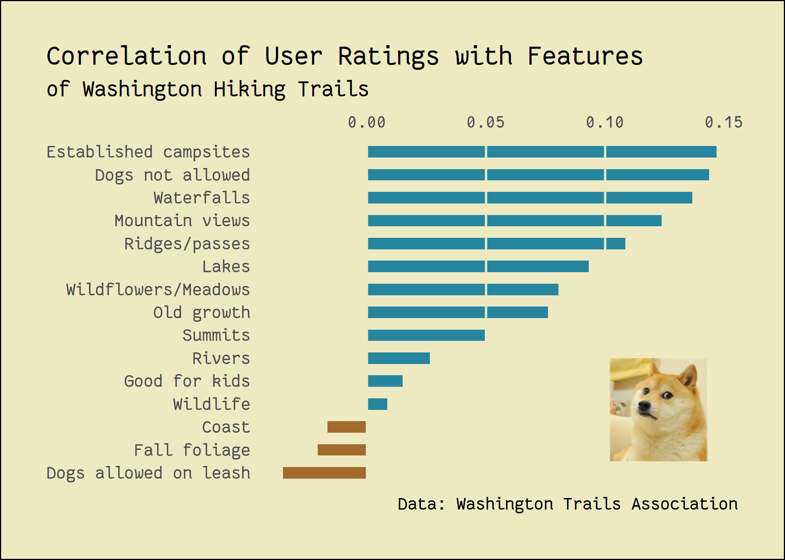
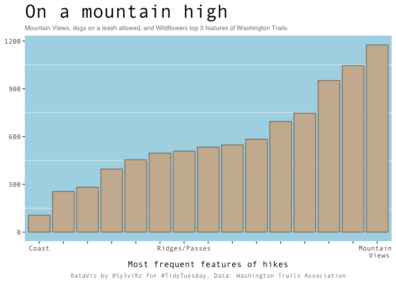
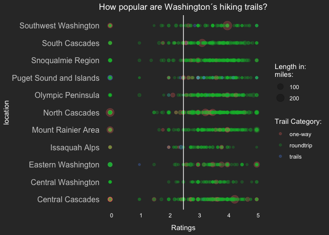
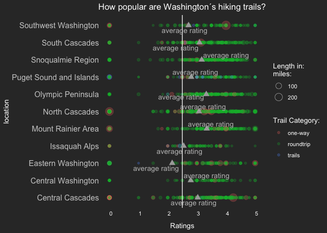
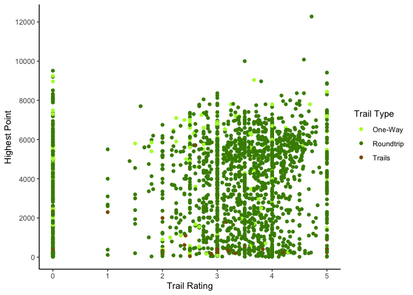
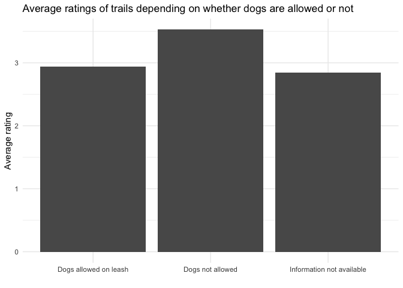

Washington Trails 🥾
================
Frie
11/24/2020

Thanks to the data, no GIFs this time (unlike [last
time](https://tidytuesday.correlaid.org/2020-11-10/))\! Instead, we have
some nice theming, simple but yet effective bar plots and a meme
embedded into a ggplot\! You can find a list of links that were shared
in our Slack channel during the hangout at the end of this post.

Enjoy\!

# A doge within a correlation plot

**By Long Nguyen**
[<!--html_preserve--><i class="fab  fa-twitter "></i><!--/html_preserve-->](https://twitter.com/long39ng)

``` r
library(tidyverse)
library(correlation)
library(tidytuesdayR)
hike_data <- tidytuesdayR::tt_load(2020, 48)$hike_data
```

    ## 
    ##  Downloading file 1 of 1: `hike_data.rds`

``` r
theme_set(
  theme_minimal(base_size = 15,
                base_family = "FantasqueSansMono Nerd Font") +
    theme(panel.ontop = TRUE,
          panel.grid = element_line(colour = "#EDEAC2"),
          panel.grid.minor = element_blank(),
          panel.grid.major.y = element_blank(),
          plot.background = element_rect(fill = "#EDEAC2"),
          plot.margin = margin(30, 30, 30, 30),
          plot.title.position = "plot",
          plot.caption.position = "plot")
)

hike_data_cleaned <- hike_data %>% 
  rownames_to_column("id") %>% 
  # https://www.youtube.com/watch?v=8w1itDDm8QU
  mutate(location_general = str_replace_all(location, "(.*)\\s[-][-].*", "\\1"),
         length_total = parse_number(length) * (str_detect(length, "one-way") + 1),
         gain = as.integer(gain),
         highpoint = as.numeric(highpoint),
         rating = as.numeric(rating))
hike_data_long <- hike_data_cleaned %>% 
  unnest(features, keep_empty = TRUE)
hike_data_onehot <- hike_data_long %>% 
  mutate(n = 1L) %>% 
  pivot_wider(names_from = features, values_from = n) %>% 
  select(-`NA`) %>% 
  mutate(across(everything(), ~ replace_na(.x, 0L)))
hike_data_onehot %>% 
  select(rating, `Dogs allowed on leash`:Summits) %>% 
  correlation::correlation() %>% 
  filter(Parameter1 == "rating") %>% 
  ggplot(aes(r, fct_reorder(Parameter2, r))) +
  geom_col(aes(fill = r > 0), width = .5, show.legend = FALSE) +
  scale_x_continuous(position = "top") +
  scale_fill_manual(values = c("#A36B2B", "#2686A0")) +
  annotation_raster(magick::image_read("https://i.imgflip.com/sepum.jpg") %>% 
                      as.raster(),
                    .102, .143, 1.5, 6, interpolate = TRUE) +
  labs(x = NULL, y = NULL,
       title = "Correlation of User Ratings with Features",
       subtitle = "of Washington Hiking Trails",
       caption = "Data: Washington Trails Association")
```



<blockquote class="twitter-tweet">

<p lang="en" dir="ltr">

My low-effort contribution at this week's
<a href="https://twitter.com/CorrelAid?ref_src=twsrc%5Etfw">@CorrelAid</a>
<a href="https://twitter.com/hashtag/TidyTuesday?src=hash&amp;ref_src=twsrc%5Etfw">\#TidyTuesday</a>
meetup.<br>Alternative title: “Washington hikers HATE dogs” (some highly
circulating tabloid,
probably)<a href="https://twitter.com/hashtag/rstats?src=hash&amp;ref_src=twsrc%5Etfw">\#rstats</a>
<a href="https://twitter.com/hashtag/dataviz?src=hash&amp;ref_src=twsrc%5Etfw">\#dataviz</a>
<a href="https://t.co/7Y0AkB9PZh">pic.twitter.com/7Y0AkB9PZh</a>

</p>

— Long Nguyen (@long39ng)
<a href="https://twitter.com/long39ng/status/1331515830794936321?ref_src=twsrc%5Etfw">November
25, 2020</a>

</blockquote>

<script async src="https://platform.twitter.com/widgets.js" charset="utf-8"></script>

# Frequency of trail features

**By Sylvi Rzepka**
[<!--html_preserve--><i class="fab  fa-twitter "></i><!--/html_preserve-->](https://twitter.com/SylviRz)

``` r
library(ggplot2)
library(hrbrthemes)
library(tidyverse)
library(ggtext)
```

``` r
hike_data <- readr::read_rds(url('https://raw.githubusercontent.com/rfordatascience/tidytuesday/master/data/2020/2020-11-24/hike_data.rds'))

hike_data_clean<- hike_data %>%
  tidyr::unnest(features)

plot4<-ggplot(hike_data_clean, aes(x=fct_rev(fct_infreq(features)))) + # ordered ascendingly
   geom_bar(stat="count", fill="bisque3", color="bisque4") +
  # Highlighting just a couple of features
   scale_x_discrete(labels=c("Coast", "", "", "", "", "", "Ridges/Passes", "", "","", "","","", "", "Mountain \n Views")) +
  # edit the theme
  theme(text = element_text(family = "Andale Mono"), legend.position = "none", # change all text font and move the legend to the bottom
        panel.grid = element_line(color="white"),  # change the grid color and remove minor y axis lines
        plot.caption = element_text(hjust = 0.5, size = 8, color = "bisque4"), # remove x-axis text and edit the caption (centered and brown)
        panel.grid.major = element_blank(),
        panel.background = element_rect(fill="lightblue"),
        plot.title = element_text(size = 24),
        plot.subtitle = element_markdown(size=8, family = "Helvetica", color = "bisque4")) + # make the title bigger and edit the subtitle (font)
  # title
  labs(title = "On a mountain high",
       subtitle = "Mountain Views, dogs on a leash allowed, and Wildflowers top 3 features of Washington Trails.",
       x = "Most frequent features of hikes", y=NULL,
       caption = "DataViz by @SylviRz for #TidyTuesday, Data: Washington Trails Association")
plot4
```

<!-- -->

# A small Shiny app

**By Fodil**
[<!--html_preserve--><i class="fab  fa-twitter "></i><!--/html_preserve-->](https://twitter.com/moh_fodil)

<blockquote class="twitter-tweet">

<p lang="und" dir="ltr">

<a href="https://twitter.com/hashtag/rstats?src=hash&amp;ref_src=twsrc%5Etfw">\#rstats</a>
<a href="https://twitter.com/hashtag/tidytuesday?src=hash&amp;ref_src=twsrc%5Etfw">\#tidytuesday</a>
<a href="https://t.co/TeGYhQed0f">pic.twitter.com/TeGYhQed0f</a>

</p>

— Ihaddaden M. EL Fodil (@moh\_fodil)
<a href="https://twitter.com/moh_fodil/status/1331343576224043009?ref_src=twsrc%5Etfw">November
24, 2020</a>

</blockquote>

<script async src="https://platform.twitter.com/widgets.js" charset="utf-8"></script>

# Trail ratings at different locations

**By Andreas Neumann**

``` r
library(ggplot2)
library(tidyverse)
library(plyr)
library(ggrepel) #for arrows and labels
```

``` r
hike_data <- readr::read_rds(url('https://raw.githubusercontent.com/rfordatascience/tidytuesday/master/data/2020/2020-11-24/hike_data.rds'))

##Data cleaning as proposed##
clean_hike_data <- hike_data %>% 
  mutate(
    trip = case_when(
      grepl("roundtrip",length) ~ "roundtrip",
      grepl("one-way",length) ~ "one-way",
      grepl("of trails",length) ~ "trails"),
    
    length_total = as.numeric(gsub("(\\d+[.]\\d+).*","\\1", length)) * ((trip == "one-way") + 1),
    
    gain = as.numeric(gain),
    rating= as.numeric(rating),
    highpoint = as.numeric(highpoint),
    
    location_general = gsub("(.*)\\s[-][-].*","\\1",location))

##Extra table to calculate mean rating for each region##
check2<-ddply(clean_hike_data, .(location_general), summarize,  rating=mean(rating))

##Table 1: no mean ratings added in plot##
ggplot()+
     geom_point(data=clean_hike_data,aes(location_general,rating,size=length_total,col=trip),alpha=0.25)+
     labs(y="Ratings", x="location",title = "How popular are Washington´s hiking trails?",
       color = "Trail Category:", size="Length in:\nmiles:")+
     geom_hline(yintercept = 2.50,color="white") +
     geom_vline(xintercept = 0)+ 
     theme(axis.title.y = element_text(color = "white"),
           axis.title.x = element_text(color = "white", margin = margin(10, 0, 0, 0)),
           axis.text.y = element_text(color = "#CCCCCC", size = 12),
           axis.ticks.y = element_blank(),
           axis.text.x = element_text(hjust = 0, color = "white"),
           panel.grid.major = element_line(linetype = "blank"),
           panel.grid.minor = element_blank(),
           panel.background = element_rect(fill = "#333333", color = NA),
           plot.background = element_rect(fill = "#333333", color = NA),
           plot.title = element_text(hjust = 0.5),
           legend.background = element_rect(fill = "#333333", color = NA),
           legend.text = element_text(color = "white"),
           legend.title = element_text(color = "white"),
           legend.key = element_rect(fill = "#333333"),
           title = element_text(colour = "#FFFFFF"))+coord_flip()
```

<!-- -->

``` r
##Table 2: mean ratings added##
ggplot()+
    geom_point(data=clean_hike_data,aes(location_general,rating,size=length_total,col=trip),alpha=0.25)+
     labs(y="Ratings", x="location",title = "How popular are Washington´s hiking trails?",
       color = "Trail Category:", size="Length in:\nmiles:")+
     geom_hline(yintercept = 2.50,color="white") +
     geom_point(data=check2, aes(location_general, rating,size=50),shape=17,alpha=1500,color="darkgrey")+ 
     ggrepel::geom_text_repel(data=check2, aes(location_general, rating),segment.color = "#CCCCCC", colour = "grey",label = "average rating")+
     guides(size = guide_legend(override.aes = list(shape = 1)))+
     geom_vline(xintercept = 0)+
     theme(axis.title.y = element_text(color = "white"),
           axis.title.x = element_text(color = "white", margin = margin(10, 0, 0, 0)),
           axis.text.y = element_text(color = "#CCCCCC", size = 12),
           axis.ticks.y = element_blank(),
           axis.text.x = element_text(hjust = 0, color = "white"),
           panel.grid.major = element_line(linetype = "blank"),
           panel.grid.minor = element_blank(),
           panel.background = element_rect(fill = "#333333", color = NA),
           plot.background = element_rect(fill = "#333333", color = NA),
           plot.title = element_text(hjust = 0.5),
           legend.background = element_rect(fill = "#333333", color = NA),
           legend.text = element_text(color = "white"),
           legend.title = element_text(color = "white"),
           legend.key = element_rect(fill = "#333333"),
           title = element_text(colour = "#FFFFFF"))+coord_flip()
```

<!-- -->

# Trail ratings, highest elevation and trail type

**By Sarah Wenzel**

``` r
library(tidyverse)
hike_data <- readr::read_rds(url('https://raw.githubusercontent.com/rfordatascience/tidytuesday/master/data/2020/2020-11-24/hike_data.rds'))
# Data cleaning from Github
clean_hike_data <- hike_data %>% 
  mutate(
    trip = case_when(
      grepl("roundtrip",length) ~ "roundtrip",
      grepl("one-way",length) ~ "one-way",
      grepl("of trails",length) ~ "trails"),
    length_total = as.numeric(gsub("(\\d+[.]\\d+).*","\\1", length)) * ((trip == "one-way") + 1),
    gain = as.numeric(gain),
    highpoint = as.numeric(highpoint),
    rating = as.numeric(rating),
    location_general = gsub("(.*)\\s[-][-].*","\\1",location)
  )
ggplot(aes(x=rating,y=highpoint,color=trip), data=clean_hike_data) +
  geom_point() +
  theme_classic() +
  scale_color_manual(name = "Trail Type", values = c("one-way" = "greenyellow", "roundtrip" = "chartreuse4", "trails"="orange4"), labels = c("One-Way", "Roundtrip", "Trails")) +
  scale_y_continuous(name="Highest Point", breaks=seq(0,12000,2000), limits=c(0, 12276)) +
  scale_x_continuous(name="Trail Rating", breaks=seq(0,5,1)) 
```

<!-- -->

# Average rating for dogs-allowed and dogs-not-allowed trails

**By Frie Preu**
[<!--html_preserve--><i class="fab  fa-twitter "></i><!--/html_preserve-->](https://twitter.com/ameisen_strasse)

``` r
library(ggplot2)
library(tidyverse)
hike_data <- readr::read_rds(url('https://raw.githubusercontent.com/rfordatascience/tidytuesday/master/data/2020/2020-11-24/hike_data.rds'))
```

``` r
hike_data$id <- 1:nrow(hike_data)

# unnest features
hike <- hike_data %>%
  tidyr::unnest(features, keep_empty = TRUE)

# dogs allowed / not allowed
hike_dogs <- hike %>% 
  mutate(dogs_info = stringr::str_extract(features, "Dogs (not )?allowed(.+)?")) %>% 
  filter(!is.na(dogs_info))

# make sure there are no cases where both dogs are allowed and not
hike_dogs %>% dplyr::count(id) %>% arrange(desc(n))# for sure there is one weird case!!
```

    ## # A tibble: 1,299 x 2
    ##       id     n
    ##    <int> <int>
    ##  1  1618     2
    ##  2     1     1
    ##  3     2     1
    ##  4     3     1
    ##  5     4     1
    ##  6     5     1
    ##  7     6     1
    ##  8     7     1
    ##  9     8     1
    ## 10     9     1
    ## # … with 1,289 more rows

``` r
hike_dogs <- hike_dogs %>% filter(id != 1618) # drop it

hike_data <- hike_data %>% 
  left_join(hike_dogs %>% select(id, dogs_info), by = "id") %>% 
  replace_na(list(dogs_info = "Information not available")) %>% 
  ungroup()

hike_data %>% 
  dplyr::group_by(dogs_info) %>% 
  dplyr::summarize(avg_rating = mean(as.numeric(rating), na.rm = TRUE)) %>% 
ggplot(aes(x = dogs_info, y = avg_rating))+
  geom_col()+
  theme_minimal()+
  labs(y = "Average rating", x = "", title = "Average ratings of trails depending on whether dogs are allowed or not")
```

    ## `summarise()` ungrouping output (override with `.groups` argument)

<!-- -->

# Links

Without much context here are some links that were shared during the
hangout in our Slack channel:

  - [The ggforce
    awakens](https://www.data-imaginist.com/2019/the-ggforce-awakens-again/)
  - tweet about how to query trails from OSM:
    <blockquote class="twitter-tweet">
    <p lang="en" dir="ltr">
    Turns out … I was just incompetent in querying OSM and understanding
    the Overpass API. The osmdata package by
    <a href="https://twitter.com/bikesRdata?ref_src=twsrc%5Etfw">@bikesRdata</a>
    and
    <a href="https://twitter.com/robinlovelace?ref_src=twsrc%5Etfw">@robinlovelace</a>
    is a lot more capable than I am, just 3 lines of code and you have
    everything you want 🎉
    <a href="https://t.co/UUbHHkDYCw">pic.twitter.com/UUbHHkDYCw</a>
    </p>
    — Marco Sciaini (@shinysci)
    <a href="https://twitter.com/shinysci/status/1311015092973113346?ref_src=twsrc%5Etfw">September
    29, 2020</a>
    </blockquote>
    <script async src="https://platform.twitter.com/widgets.js" charset="utf-8"></script>
  - This nice contribution by @[kllycttn](https://twitter.com/kllycttn):
    <blockquote class="twitter-tweet">
    <p lang="en" dir="ltr">
    <a href="https://twitter.com/hashtag/TidyTuesday?src=hash&amp;ref_src=twsrc%5Etfw">\#TidyTuesday</a>
    this week: Top Washington State trail
    names.<a href="https://twitter.com/hashtag/RStats?src=hash&amp;ref_src=twsrc%5Etfw">\#RStats</a>
    code here (with a bonus name generator at the end):
    <a href="https://t.co/s11em5WW3h">https://t.co/s11em5WW3h</a>
    <a href="https://t.co/sS9nZth44d">pic.twitter.com/sS9nZth44d</a>
    </p>
    — Kelly Cotton (@kllycttn)
    <a href="https://twitter.com/kllycttn/status/1331291351393181698?ref_src=twsrc%5Etfw">November
    24, 2020</a>
    </blockquote>
    <script async src="https://platform.twitter.com/widgets.js" charset="utf-8"></script>
  - and the accompanying code:
    <https://github.com/kellycotton/TidyTuesdays/blob/master/code/hiking.R>
  - [Blog post about the ggplot 3.3.0
    release](https://www.tidyverse.org/blog/2020/03/ggplot2-3-3-0/)
