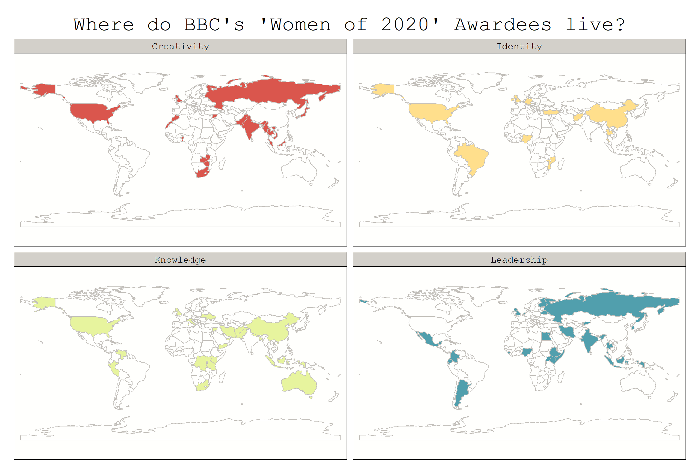

```{r setup, include=FALSE}
knitr::opts_chunk$set(echo = TRUE)
library(fontawesome)
```

This week's TidyTuesday, we worked with the BBC 100 leading women of 2020 dataset. Whether we made our very first steps in ggplot, "dabbled in the table-making business", made beautiful maps, built dashboards or did text analysis: Besides learning new #rstats stuff, we also got to know some more of the many many amazing women who change the world everyday.

Before we dive into the code + plots, here are the links that were shared in our Slack channel during the event:

- [inspiration for combining wordclouds with maps](https://twitter.com/JDavison_/status/1336266410297880576)
- [theming reactable tables example](https://glin.github.io/reactable/articles/examples.html#theming-1)
- [Cédric Scherer's incredible ggplot2 tutorial](https://cedricscherer.netlify.app/2019/08/05/a-ggplot2-tutorial-for-beautiful-plotting-in-r/)
- [3D Graphics using the grammar of graphics](https://coolbutuseless.github.io/package/ggrgl/index.html)
- [a resource for getting spatial data](https://exploratory.io/map)

## A visualization of word stems associated with each category
**By Sylvi Rzepka** [`r fa("twitter", fill = "#1da1f2")`](https://twitter.com/SylviRz)

```{r sylvi-setup, message=FALSE}
library(tidytuesdayR)
library(ggplot2)
library(tidyverse)
library(rvest)
library(tokenizers)
library(tidytext)
library(rcartocolor)
library(stopwords)
library(ggtext)
library(ggwordcloud)
library(SnowballC) #for stemming
women <- tidytuesdayR::tt_load('2020-12-08')$women
```


```{r sylvi, message=FALSE}
# Getting tokens (by category), removing stopwords, stemming
descr_token_wostop<-women %>%
    select(category, description) %>%
    # replace co-founder by cofounder
    mutate(description = gsub("woman", "women", description)) %>%
    mutate(description = gsub("co-founder", "cofounder", description)) %>%
    mutate(description = gsub("'", "", description)) %>%
    mutate(description = gsub("'", "", description)) %>%
    unnest_tokens(word, description)%>% 	
    filter(!(word %in% stopwords(source = "snowball"))) %>%
    #also removing: year, name, dr, work and numbers (because not super informative)
    filter(!(word %in% c("year", "around", "name","dr", "work", "19", "22", "23", "2020"))) %>%
    mutate(stem = wordStem(word)) %>%
    group_by(category) %>%
    count(stem) %>%
    arrange(desc(n)) %>%
    filter(n>1) %>% #keeping only those stems mentioned more than once 
    slice(1:10)
#Plotting
plot<-ggplot(
  descr_token_wostop,
  aes(
    label = stem, size = n,
    x=category, color = category)
  ) +
  geom_text_wordcloud_area() +
  scale_size_area(max_size = 7) +
  scale_color_carto_d(palette="Bold") +
#Layouting
  theme_minimal() +
  coord_flip() +
  theme(aspect.ratio = 1.5,
      text = element_text(family = "Andale Mono"), legend.position = "none", # change all text font and remove the legend
      panel.grid = element_line(color="white"),  # change the grid color and remove minor y axis lines
      plot.caption = element_text(hjust = 0, size = 9, color = "#11A579"),
      plot.title = element_text(size = 18), plot.subtitle = element_markdown(size=9, family = "Helvetica", color = "#11A579"),
      axis.text=element_text(size=14)) +
  # title
  labs(title = "Describing inspiring women",
       subtitle = "with the top 10 word stems by category from the BBC 2020 list",
       x = NULL, y=NULL,
       caption = "DataViz by @SylviRz for #TidyTuesday, data from BBC")
ggsave("describing_influential_women.png", width=5.5, height=8)
```

<blockquote class="twitter-tweet"><p lang="en" dir="ltr">Did some tokenizing and stemming with {tidytext} for this week&#39;s <a href="https://twitter.com/hashtag/TidyTuesday?src=hash&amp;ref_src=twsrc%5Etfw">#TidyTuesday</a> during our <a href="https://twitter.com/CorrelAid?ref_src=twsrc%5Etfw">@CorrelAid</a> virtual hangout. <a href="https://t.co/TOsv52dCDE">pic.twitter.com/TOsv52dCDE</a></p>&mdash; Sylvi Rzepka (@SylviRz) <a href="https://twitter.com/SylviRz/status/1336791137135308801?ref_src=twsrc%5Etfw">December 9, 2020</a></blockquote> <script async src="https://platform.twitter.com/widgets.js" charset="utf-8"></script> 

## Maps for each category
**By Patrizia Maier**

```{r patrizia, eval = FALSE}
# get packages 
library(rnaturalearth)
library(countrycode)
library(tmap)
library(tidyverse)

# get data 
tuesdata <- tidytuesdayR::tt_load('2020-12-08')
women <- tuesdata$women

# clean data 
women <- women[!women$name == "Unsung hero",] # remove Unsung hero, sorry
women <- women %>% 
  mutate(country = case_when(
      country=="India " ~ "India",
      country=="Somaliland" ~ "Somalia",
      country=="UK " | country=="Iraq/UK" | country=="Wales, UK" | country=="Northern Ireland" ~ "UK",
      country=="Exiled Uighur from Ghulja (in Chinese, Yining)" ~ "China", 
      TRUE ~ country))

# save country code and continent information
women$iso_a3 <- countrycode(women$country, origin = 'country.name', destination = 'iso3c')

# get world geometry polygons 
world <- ne_countries(returnclass='sf') %>% 
  select("iso_a3", "geometry")

# join data 
dat <- left_join(world, 
                 women %>%
                   group_by(iso_a3, category) %>% 
                   summarise(count = n()), 
                 by="iso_a3") %>%
  mutate(anyone=if_else(count > 0, 1, 0))
dat
# make map
tmap_style("white")
tm_shape(dat) + 
  tm_fill(col="category", legend.show=FALSE, palette="Spectral") + 
  tm_facets(by="category", free.coords=FALSE, drop.units=TRUE,  drop.NA.facets=TRUE) +
  tm_layout(main.title="Where do BBC's 'Women of 2020' Awardees live?", 
            main.title.position = "center",
            sepia.intensity=0.1,
            fontfamily="mono") + 
  tm_shape(dat) + 
  tm_borders(col="grey")
```


### A simple yet effective bar chart
**By Lena**
```{r lena-setup, message=FALSE}
# Load packages
library(tidyverse)
library(countrycode)

# Load the data
women <- readr::read_csv('https://raw.githubusercontent.com/rfordatascience/tidytuesday/master/data/2020/2020-12-08/women.csv')
```


```{r lena}
# Clean country names and add continent
women$country_clean = women$country
women$country_clean[women$country_clean=="UK"] <- "United Kingdom"
women$country_clean[women$country_clean=="Northern Ireland"] <- "United Kingdom"
women$country_clean[women$country_clean=="Wales"] <- "United Kingdom"
women$country_clean[women$country_clean=="Exiled Uighur from Ghulja (in Chinese, Yining)"] <- "China"
women$continent <-countrycode(sourcevar=women$country_clean, origin="country.name", destination="continent")

# Plot a bar chart
(g <- ggplot(data=women, aes(y=continent))) + geom_bar(aes(fill=category), stat="count")
```

## An interactive table 
By **Long Nguyen** [`r fa("twitter", fill = "#1da1f2")`](https://twitter.com/long39ng) and **Frie Preu** [`r fa("twitter", fill = "#1da1f2")`](https://twitter.com/ameisen_strasse)

<blockquote class="twitter-tweet"><p lang="en" dir="ltr">This <a href="https://twitter.com/hashtag/TidyTuesday?src=hash&amp;ref_src=twsrc%5Etfw">#TidyTuesday</a>, <a href="https://twitter.com/ameisen_strasse?ref_src=twsrc%5Etfw">@ameisen_strasse</a> and I dabbled in the table-making business and created an interactive table using {reactable} and {crosstalk}, showcasing BBC&#39;s list of 100 inspiring women in 2020.<br><br>👉 table and code: <a href="https://t.co/xOz1aicYnw">https://t.co/xOz1aicYnw</a> <a href="https://twitter.com/CorrelAid?ref_src=twsrc%5Etfw">@CorrelAid</a> <a href="https://twitter.com/hashtag/Rstats?src=hash&amp;ref_src=twsrc%5Etfw">#Rstats</a> <a href="https://twitter.com/hashtag/dataviz?src=hash&amp;ref_src=twsrc%5Etfw">#dataviz</a> <a href="https://t.co/Rxz7bMvbuu">pic.twitter.com/Rxz7bMvbuu</a></p>&mdash; Long Nguyen (@long39ng) <a href="https://twitter.com/long39ng/status/1336634512441225217?ref_src=twsrc%5Etfw">December 9, 2020</a></blockquote> <script async src="https://platform.twitter.com/widgets.js" charset="utf-8"></script> 

<blockquote class="twitter-tweet"><p lang="en" dir="ltr">was super fun working on this <a href="https://twitter.com/hashtag/tidytuesday?src=hash&amp;ref_src=twsrc%5Etfw">#tidytuesday</a> together with <a href="https://twitter.com/long39ng?ref_src=twsrc%5Etfw">@long39ng</a> at the <a href="https://twitter.com/CorrelAid?ref_src=twsrc%5Etfw">@CorrelAid</a> <a href="https://twitter.com/hashtag/TidyTuesday?src=hash&amp;ref_src=twsrc%5Etfw">#TidyTuesday</a> hangout! In addition to the descriptions by <a href="https://twitter.com/BBCNews?ref_src=twsrc%5Etfw">@BBCNews</a> we also included links to Wikipedia so you can learn even more about those amazing women! <a href="https://twitter.com/hashtag/rstats?src=hash&amp;ref_src=twsrc%5Etfw">#rstats</a> <a href="https://t.co/tflp9ZU3RQ">https://t.co/tflp9ZU3RQ</a></p>&mdash; Frie (@ameisen_strasse) <a href="https://twitter.com/ameisen_strasse/status/1336636291929223169?ref_src=twsrc%5Etfw">December 9, 2020</a></blockquote> <script async src="https://platform.twitter.com/widgets.js" charset="utf-8"></script> 

- [Table and Code](https://rpubs.com/long39ng/bbc-women-2020)

## A small RMarkdown dashboard 
**By Fodil** [`r fa("twitter", fill = "#1da1f2")`](https://twitter.com/moh_fodil)


<blockquote class="twitter-tweet"><p lang="en" dir="ltr">My tiny contribution to this week <a href="https://twitter.com/hashtag/TidyTuesday?src=hash&amp;ref_src=twsrc%5Etfw">#TidyTuesday</a>. A big thanks to the <a href="https://twitter.com/CorrelAid?ref_src=twsrc%5Etfw">@CorrelAid</a> group for organizing the virtual meet up and for the motivation :) <a href="https://twitter.com/hashtag/rstats?src=hash&amp;ref_src=twsrc%5Etfw">#rstats</a> <a href="https://t.co/8pG0phqe7I">https://t.co/8pG0phqe7I</a><br><br>repo: <a href="https://t.co/kQij9OprGt">https://t.co/kQij9OprGt</a> <a href="https://t.co/fUEZCw8bpl">pic.twitter.com/fUEZCw8bpl</a></p>&mdash; Ihaddaden M. EL Fodil ®️ (@moh_fodil) <a href="https://twitter.com/moh_fodil/status/1336447357047746561?ref_src=twsrc%5Etfw">December 8, 2020</a></blockquote> <script async src="https://platform.twitter.com/widgets.js" charset="utf-8"></script> 

- [Interactive Dashboard](https://tidytuesdaybbcwomen.netlify.app/)
- [Code in GitHub Repo](https://github.com/feddelegrand7/WCorrelTidy/blob/master/index.Rmd)


## A category by country point "heatmap"
**By Saleh Hamed**

```{r saleh-setup, message=FALSE}
#package loading
library(tidyverse)

#getting data
womenn <- readr::read_csv('https://raw.githubusercontent.com/rfordatascience/tidytuesday/master/data/2020/2020-12-08/women.csv')
```


```{r saleh}
#cleaning data
womenn <- womenn[!womenn$name == "Unsung hero",] 
womenn <- womenn %>% 
  mutate(country = case_when(
    country=="India " ~ "India",
    country=="Somaliland" ~ "Somalia",
    country=="UK " | country=="Iraq/UK" | country=="Wales, UK" | country=="Northern Ireland" ~ "UK",
    country=="Exiled Uighur from Ghulja (in Chinese, Yining)" ~ "China", 
    TRUE ~ country))

#data visualization
ggplot(womenn, aes(x=category, y= country)) +
  geom_point(alpha=0.7)
```

## Countries in popcircles!
**By Andreas Neumann**
using the popcircle package:
- https://github.com/rCarto/popcircle
- https://rgeomatic.hypotheses.org/1780

```{r andreas-setup, message=FALSE}
library(tidyverse)
library(cartography)
library(remotes)
library(popcircle)
library(sf)
##Download the data##
url<-"https://download2.exploratory.io/maps/world.zip"
download.file(url, dest="world.zip", mode="wb") 
unzip("world.zip", exdir = "world")
worldgeo <- sf::st_read("world/world.geojson")
names(worldgeo)[1]<-"country"
women <- readr::read_csv('https://raw.githubusercontent.com/rfordatascience/tidytuesday/master/data/2020/2020-12-08/women.csv')
```


```{r andreas, eval=FALSE}
##Data Wrangling and merge data sets##
women$country <- gsub("Exiled Uighur from Ghulja (in Chinese, Yining)", "China", women$country,fixed = T)
women$country <- gsub("Iraq/UK", "United Kingdom", women$country, fixed=T)
women$country <- gsub("DR Congo", "Dem. Rep. Congo", women$country)
women$country <- gsub("Northern Ireland", "United Kingdom", women$country)
women$country <- gsub("Republic of Ireland", "Ireland", women$country)
women$country <- gsub("UAE", "United Arab Emirates",women$country)
women$country <- gsub("UK", "United Kingdom",women$country)
women$country <- gsub("US", "United States", women$country)
women$country <- gsub("Wales, United Kingdom", "United Kingdom",women$country, fixed=T)
womenworld<-merge(worldgeo, women,by="country")
count<- womenworld%>% 
  dplyr::group_by(country,role) %>% 
  dplyr::summarise(Freq=n())
##Create Popcircle##
pop <- popcircle(x = count, var = "Freq")                                                             
pop_circle <- pop$circle
pop_shape <-pop$shapes
pop_shape <- st_transform(pop_shape, 4326)
pop_circle <- st_transform(pop_circle, 4326)
plot(st_geometry(pop_circle), bg = "#333333",col = "#FFFFFF", border = "white")                       
plot(st_geometry(pop_shape), col = "#FFFFFF", border = "#333333",add = TRUE, lwd = 1.5)
labelLayer(x = pop_circle, txt = "role", halo = TRUE, overlap = FALSE, col = "#666666", r=.15)

# works on windows only
windowsFonts(A=windowsFont("Bookman Old Style"))
tt <- st_bbox(pop_circle)
text(tt[1], tt[4], labels = "100 WOMEN...",family="A",font=3,adj=c(0,1),
      col = "grey", cex = 2)
text(tt[2], tt[2], labels = "...leading change in 2020",family="A", font=3,adj=c(0,1),
     col = "grey", cex = 1.5)

```


