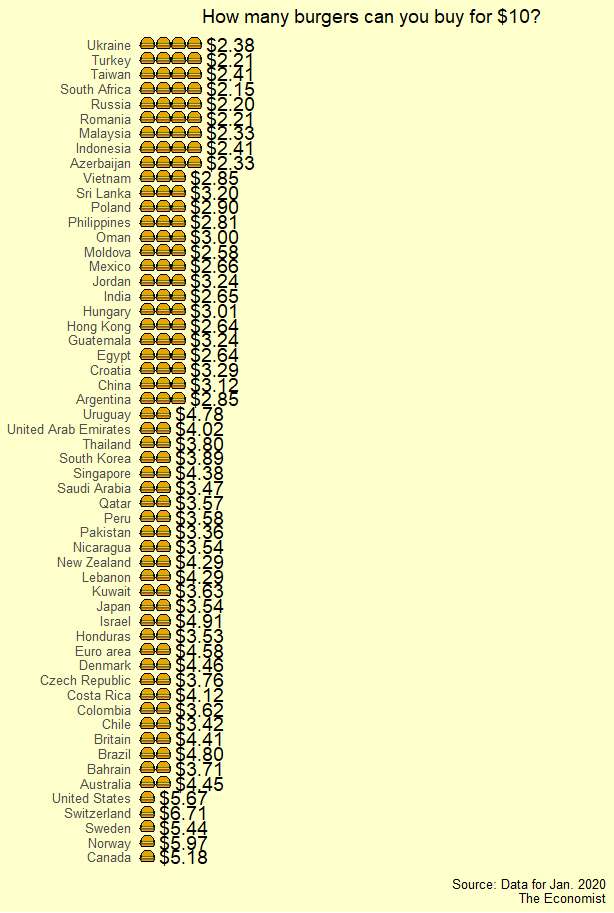
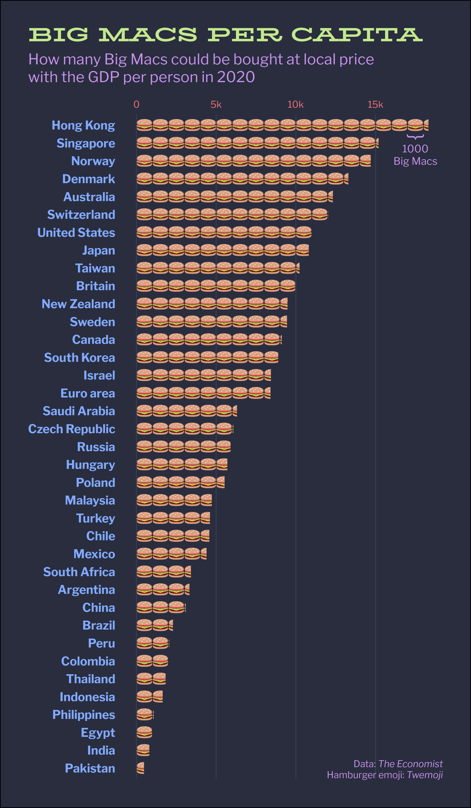
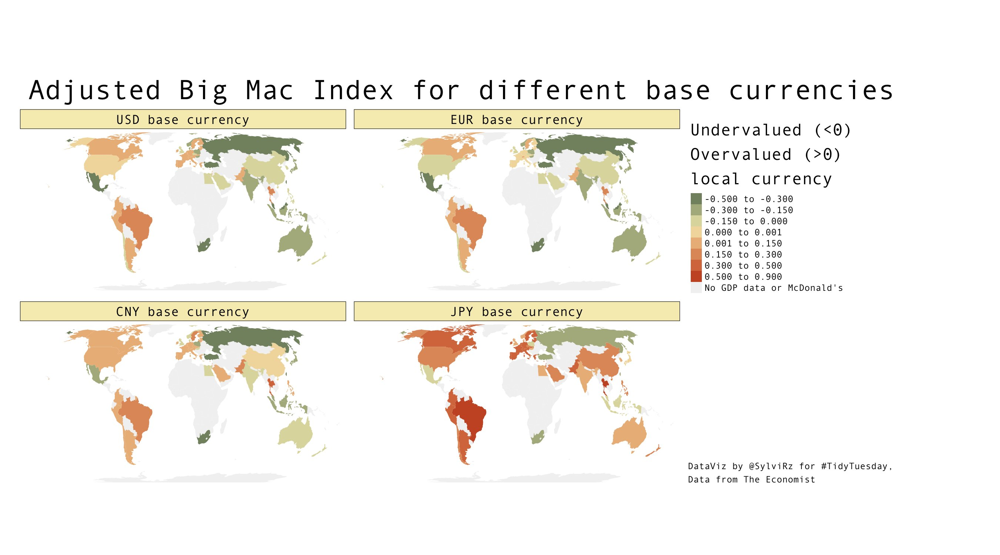
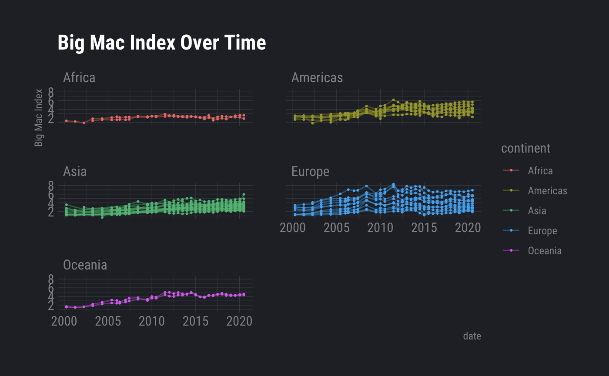

The Big Mac index 🍔
================

# Animated Graph No. 1

**By Patrizia Maier**

```r
# get packages
library(rnaturalearth)
library(tmap)
library(tidyverse)
library(gifski)
library(extrafont)
```
```r
# font_import() # only once
loadfonts(device = "win", quiet = TRUE) # every time# get data
tuesdata <- tidytuesdayR::tt_load('2020-12-22')
big_mac <- tuesdata$`big-mac`# inspect data
# lots of missing values in GDP_dollar, adj_price, XXX_adjusted --> correct or use other vars
# unique(big_mac$date) # from 2000 to 2020 --> use as time factor# get world geometry polygons
world <- ne_countries(returnclass='sf') %>%
  select("iso_a3", "geometry")# join data
dat <- left_join(world,
                 big_mac %>%
                   group_by(date),
                 by="iso_a3")
dat$date <- as.factor(dat$date)
```
```r
# create map

tmap_style("white")

animation <- tm_shape(dat) +
  tm_fill(col="usd_raw", legend.show=TRUE, title="Rel. index to USD (raw)", palette="-RdYlGn", midpoint=0) +
  tm_facets(by="date", free.coords=FALSE, drop.units=TRUE,  drop.NA.facets=TRUE, nrow = 1, ncol = 1) +
  tm_layout(main.title="How expensive is a Big Mac ...",
            main.title.position="left",
            main.title.size=3,
            main.title.color="#003366",
            title="... compared to buying it in the US?",
            title.color="#003366",
            title.size=2,
            title.position=c("right","bottom"),
            legend.position=c("left", "bottom"),
            legend.title.size=1.75,
            legend.text.size=1.25,
            panel.label.size=1.5,
            sepia.intensity=0.1,
            fontfamily="Segoe UI Semibold") +
  tm_shape(dat %>% filter(iso_a3=="USA")) +
  tm_fill("#003366") +
  tm_shape(dat) +
  tm_borders(col="grey")# save as gif with time factor
tmap_animation(animation, filename="big_mac_anim.gif", delay=100, restart.delay=200,
               width=1200, height=600)
```

<!-- -->

# Plot No. 1
**By Andreas Neumann**


<!-- -->

# Plot No. 2
**By Long Nguyen** (@long39ng)
``` r
library(tidyverse)
library(ggtext)
library(ggtextures)

theme_set(
  theme_minimal(base_family = "Libre Franklin", base_size = 16) +
    theme(axis.text.x = element_text(size = 10, colour = "#f07178"),
          axis.text.y = element_text(face = "bold", colour = "#82aaff"),
          panel.grid = element_blank(),
          panel.grid.major.x = element_line(colour = "#373c53", size = .5),
          plot.background = element_rect(fill = "#292d3e"),
          plot.margin = margin(30, 30, 30, 30),
          plot.title = element_markdown(size = rel(1.3),
                                        family = "BioRhyme Expanded",
                                        colour = "#c3e88d",
                                        lineheight = 1.5),
          plot.subtitle = element_markdown(colour = "#c792ea",
                                           lineheight = 1.2,
                                           margin = margin(b = 15)),
          plot.title.position = "plot",
          plot.caption = element_markdown(size = 10,
                                          colour = "#c792ea",
                                          lineheight = 1.2,
                                          margin = margin(t = -20)))
)
```

```r
big_mac <- readr::read_csv('https://raw.githubusercontent.com/rfordatascience/tidytuesday/master/data/2020/2020-12-22/big-mac.csv')
glimpse(big_mac)
#> Rows: 1,386
#> Columns: 19
#> $ date          <date> 2000-04-01, 2000-04-01, 2000-04-01, 2000-04-01, 2000-0…
#> $ iso_a3        <chr> "ARG", "AUS", "BRA", "CAN", "CHE", "CHL", "CHN", "CZE",…
#> $ currency_code <chr> "ARS", "AUD", "BRL", "CAD", "CHF", "CLP", "CNY", "CZK",…
#> $ name          <chr> "Argentina", "Australia", "Brazil", "Canada", "Switzerl…
#> $ local_price   <dbl> 2.50, 2.59, 2.95, 2.85, 5.90, 1260.00, 9.90, 54.37, 24.…
#> $ dollar_ex     <dbl> 1.0000000, 1.6800000, 1.7900000, 1.4700000, 1.7000000, …
#> $ dollar_price  <dbl> 2.500000, 1.541667, 1.648045, 1.938776, 3.470588, 2.451…
#> $ usd_raw       <dbl> -0.00398, -0.38579, -0.34341, -0.22758, 0.38270, -0.023…
#> $ eur_raw       <dbl> 0.05007, -0.35246, -0.30778, -0.18566, 0.45774, 0.02964…
#> $ gbp_raw       <dbl> -0.16722, -0.48645, -0.45102, -0.35417, 0.15609, -0.183…
#> $ jpy_raw       <dbl> -0.09864, -0.44416, -0.40581, -0.30099, 0.25130, -0.116…
#> $ cny_raw       <dbl> 1.09091, 0.28939, 0.37836, 0.62152, 1.90267, 1.05023, 0…
#> $ gdp_dollar    <dbl> NA, NA, NA, NA, NA, NA, NA, NA, NA, NA, NA, NA, NA, NA,…
#> $ adj_price     <dbl> NA, NA, NA, NA, NA, NA, NA, NA, NA, NA, NA, NA, NA, NA,…
#> $ usd_adjusted  <dbl> NA, NA, NA, NA, NA, NA, NA, NA, NA, NA, NA, NA, NA, NA,…
#> $ eur_adjusted  <dbl> NA, NA, NA, NA, NA, NA, NA, NA, NA, NA, NA, NA, NA, NA,…
#> $ gbp_adjusted  <dbl> NA, NA, NA, NA, NA, NA, NA, NA, NA, NA, NA, NA, NA, NA,…
#> $ jpy_adjusted  <dbl> NA, NA, NA, NA, NA, NA, NA, NA, NA, NA, NA, NA, NA, NA,…
#> $ cny_adjusted  <dbl> NA, NA, NA, NA, NA, NA, NA, NA, NA, NA, NA, NA, NA, NA,…

burger_img <- "https://twemoji.maxcdn.com/v/latest/72x72/1f354.png"

big_mac_capita <- big_mac %>% 
  slice_max(date) %>% 
  drop_na(gdp_dollar) %>% 
  mutate(n_burgers = gdp_dollar / dollar_price / 1000)
```

```r
big_mac_capita %>% 
  ggplot(aes(x = fct_reorder(name, n_burgers), y = n_burgers)) +
  geom_isotype_col(image = burger_img,
                   img_width = unit(1, "native"),
                   img_height = unit(.7, "native"),
                   ncol = NA, nrow = 1, hjust = 0, vjust = .5) +
  scale_y_continuous(position = "right", labels = function(x) {
    x <- paste0(x, "k")
    x[x == "0k"] <- "0"
    x
  }) +
  annotate(geom = "text", x = 36.5, y = 17.5, label = "}",
           hjust = 0, vjust = .39, angle = 270,
           family = "Libre Franklin", colour = "#c792ea", size = 7) +
  annotate(geom = "text", x = 35.9, y = 17.5, label = "1000\nBig Macs",
           hjust = .5, vjust = 1, lineheight = 1,
           family = "Libre Franklin", colour = "#c792ea") +
  coord_flip() +
  labs(x = NULL, y = NULL,
       title = toupper("Big Macs per capita"),
       subtitle = "How many Big Macs could be bought at local price<br>
                   with the GDP per person in 2020",
       caption = "Data: *The Economist*<br>Hamburger emoji: *Twemoji*")

```


<!-- -->

# Plot No. 3
**By Sylvi Rzepka** (@SylviRz)

```r
library(ggplot2)
library(tidytuesdayR)
library(tidyverse)
library(tmap)
library(sf) # for worldmap data
library(dplyr)
library(rcartocolor)
```
```r
# Read in as a dataframe
bigmac <- as.data.frame(tt_load('2020-12-22')$"big-mac")
class(bigmac)
str(bigmac)
summary(bigmac$date)
table(bigmac$name)
```r
#loading world map data
data("World") 
```
```r
######data prep
#Extracting the Eurozone
eurozone<- bigmac %>%
  filter(date=="2020-07-01") %>%
  filter(iso_a3=="EUZ") %>%
  dplyr::select(!iso_a3) %>%
  #duplicating 19x one line for each euro zone country
  slice(rep(1:n(), each=19))
  
#### iso_a3 for all eurozone countries  
eurozone$iso_a3<-c("AUT", "BEL", "CYP", "EST", "FIN", "FRA", "DEU", "GRC",
                   "IRL", "ITA", "LUX", "LVA", "LTU", "MLT", "NLD",
                   "PRT", "SVK", "SVN", "ESP")
```
```r
# binding eurozone to bigmac data
bigmac2<-rbind(bigmac, eurozone)

bigmac_prep <- bigmac2 %>%
  #filtering for last date
  filter(date=="2020-07-01")%>%
  #dropping aggregated Euro zone line
  filter(iso_a3!="EUZ") %>%
  # keeping only a few vars, "..._adjusted" is the GPD adjusted over/undervaluation with respect to the currency
  dplyr::select(iso_a3, usd_raw, gdp_dollar, usd_adjusted, eur_adjusted, cny_adjusted, jpy_adjusted) 
```
```r
#Joining the population to the shapefile data from world
bigmac_shapedata <- merge(World, bigmac_prep, by.x="iso_a3", by.y="iso_a3", all.x=TRUE)
head(bigmac_shapedata)
```
```r
# Plotting 
my_colors = carto_pal(7, "Fall")

map1<-tm_shape(bigmac_shapedata) +
  tm_fill(title="Legend: \nUndervalued (<0) \nOvervalued (>0) \nlocal currency", 
          c("usd_adjusted", "eur_adjusted", "cny_adjusted", "jpy_adjusted"),
          midpoint=0,
          breaks=c(-.5, -.3, -.15, 0, 0.001, .15, .3, .5, .9),
          palette=my_colors,
          colorNA="grey95",
          textNA = "No GDP data \nor McDonald's") + #c("usd_raw", "eur_raw", "cny_raw", "jpy_raw")
  tm_facets(sync = TRUE, ncol = 2, nrow=2,) +
  tm_layout(main.title="Adjusted Big Mac Index for different base currencies",
            #main.subtitle="Shows how under- and overevaluation depends on the perspective",
            title="DataViz by @SylviRz for #TidyTuesday \nData from The Economist",
            title.size=1,
            title.position=c("left","BOTTOM"),
            fontfamily="Andale Mono",
            legend.outside = TRUE,
            panel.labels=c("USD base currency", "EUR base currency", "CNY base currency", "JPY base currency"),
            panel.label.bg.color = my_colors[4],
            frame=FALSE)

map1
tmap_save(
  tm = map1,
  filename = "bigmacindex_by_currency")
```

<!-- -->

# Plot No. 4
**By Frie Preu**

``` r
library(tidyverse)
library(countrycode)
library(hrbrthemes)

# load data 
big_mac <- readr::read_csv('https://raw.githubusercontent.com/rfordatascience/tidytuesday/master/data/2020/2020-12-22/big-mac.csv')

big_mac <- big_mac %>% 
  mutate(date = lubridate::ymd(date),
         year = lubridate::year(date))

# add continent
big_mac$continent <- countrycode(big_mac$iso_a3, origin = 'iso3c', destination = 'continent')
big_mac <- big_mac %>% 
  mutate(continent = if_else(iso_a3 == "EUZ", "Europe", continent))

ggplot(big_mac, aes(x = date, group = iso_a3, color = continent, y = dollar_price))+
  geom_point(size = 0.4)+
  geom_line(alpha = 0.4)+
  facet_wrap(~continent, ncol = 2)+
  theme_ft_rc()+
  labs(title = "Big Mac Index Over Time", y = "Big Mac Index")
```

<!-- -->
