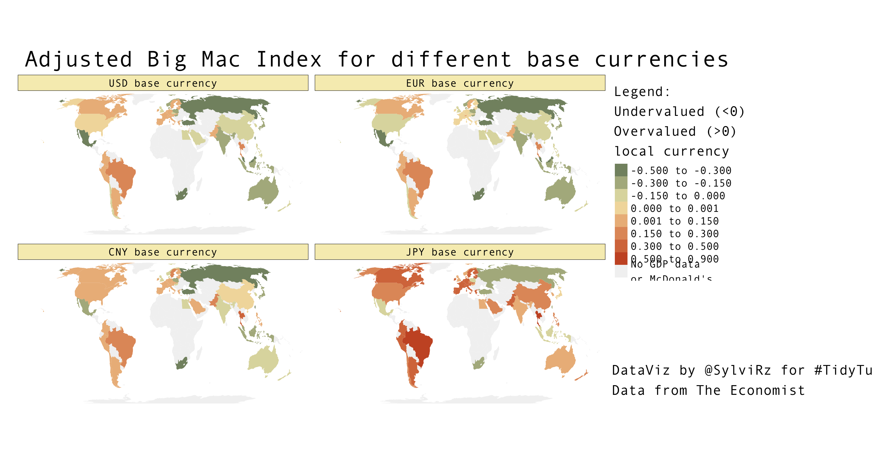

The Big Mac index 🍔
================

# Animated Graph No. 1

**By Patrizia Maier**


<!-- -->

# Plot No. 1
**By Andreas Neumann**


<!-- -->

# Plot No. 2
**By Long Nguyen** (@long39ng)


<!-- -->

# Plot No. 3
**By Sylvi Rzepka** (@SylviRz)

<!-- -->

# Plot No. 4
**By Frie Preu**

``` r
library(tidyverse)
library(countrycode)
library(hrbrthemes)

# load data 
big_mac <- readr::read_csv('https://raw.githubusercontent.com/rfordatascience/tidytuesday/master/data/2020/2020-12-22/big-mac.csv')

big_mac <- big_mac %>% 
  mutate(date = lubridate::ymd(date),
         year = lubridate::year(date))

# add continent
big_mac$continent <- countrycode(big_mac$iso_a3, origin = 'iso3c', destination = 'continent')
big_mac <- big_mac %>% 
  mutate(continent = if_else(iso_a3 == "EUZ", "Europe", continent))

ggplot(big_mac, aes(x = date, group = iso_a3, color = continent, y = dollar_price))+
  geom_point(size = 0.4)+
  geom_line(alpha = 0.4)+
  facet_wrap(~continent, ncol = 2)+
  theme_ft_rc()+
  labs(title = "Big Mac Index Over Time", y = "Big Mac Index")
```

<!-- -->
