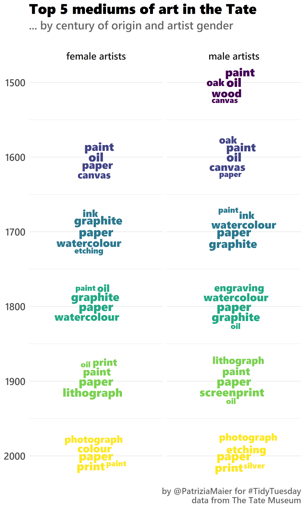
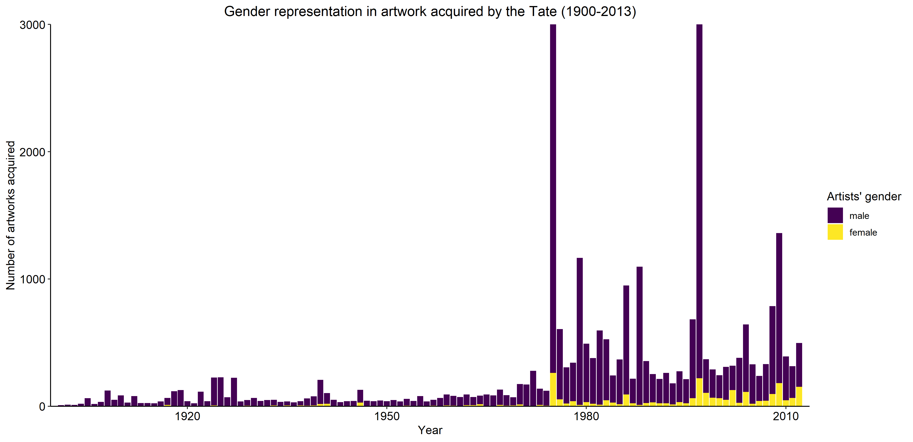

Art Collections 🎨
================

# Plot No. 1

**By Patrizia Maier**

```r
# get packages
library(tidyverse)
library(tidytext)
library(stopwords)
library(ggwordcloud)
library(viridis)
library(extrafont)
# font_import() # only once
loadfonts(device = "win", quiet = TRUE)
```
```r
# get data
tuesdata <- tidytuesdayR::tt_load('2021-01-12')
artwork <- tuesdata$artwork
artists <- tuesdata$artists# inspect data
length(unique(artwork$artistId)) # 3532 different artists and over 69.000 different artworks
count(artists, gender) # 521 women, 2895 men, 116 NA
count(artwork, medium, sort=TRUE) # already > 3000 unique technique but overlapping in syntax --> tidytext
count(artwork, year) # from 1545 till 2012, many more in recent years# join data sets
```
```r
data <- left_join(artwork,
                  artists,
                  by = c("artistId" = "id"))# add century
data <- data %>%
  mutate(century=plyr::round_any(data$year, 100, f = floor))# most frequent keywords per category (with tidytext)
top=5
word_counts <- data %>%
  select(id, medium, century, gender) %>%
  drop_na() %>%
  unnest_tokens(word, medium) %>%
  anti_join(get_stopwords()) %>%
  group_by(century, gender) %>%
  count(word) %>%
  arrange(desc(n)) %>%
  slice(1:top) %>%
  mutate(rank=order(n, decreasing=TRUE))
``` 
 
```r 
# create plot
set.seed(100)
ggplot(word_counts, aes(x=century, label=word, size=rank, color=century)) +
  geom_text_wordcloud(family="Segoe UI Black", shape="circle", eccentricity=0.4) +
  scale_size(range=c(4,6), trans='reverse') +
  coord_flip() +
  scale_x_reverse() +
  scale_color_viridis() +
  facet_wrap(~gender, ncol=2, labeller=as_labeller(c(`Female` = "female artists", `Male` = "male artists"))) +
  labs(title="Top 5 mediums of art in the Tate",
       subtitle="... by century of origin and artist gender\n",
       caption="\nby @PatriziaMaier for #TidyTuesday\ndata from The Tate Museum",
       x=NULL, y=NULL) +
  theme_minimal() +
  theme(plot.title = element_text(family = "Segoe UI Black", size=20),
        plot.subtitle = element_text(family = "Segoe UI Semibold", size=16, color="#666666"),
        plot.caption = element_text(family = "Segoe UI Semibold", size=12, color="#666666"),
        axis.text = element_text(family = "Segoe UI Semibold", size=14),
        strip.text.x = element_text(family = "Segoe UI Semibold", size=14))
```



# Plot No. 2 

**By Long Nguyen**

```r
knitr::opts_chunk$set(echo = TRUE, collapse = TRUE, comment = "#>",
                      fig.path = "figs/", dpi = 300,
                      dev.args = list(bg = "transparent"))
knitr::knit_hooks$set(optipng = knitr::hook_optipng)
```

```r
library(tidyverse)
library(magick)
library(furrr)
```

```r
artwork <- rio::import("https://raw.githubusercontent.com/rfordatascience/tidytuesday/master/data/2021/2021-01-12/artwork.csv",
                       setclass = "tibble")
plan(multisession)
artwork <- artwork %>% 
  mutate(median_col = future_map_chr(
    thumbnailUrl,
    possibly(~ .x %>% 
               image_read() %>% 
               image_quantize(1, "rgb") %>% 
               # Credit: https://chichacha.netlify.app/2019/01/19/extracting-colours-from-your-images-with-image-quantization/
               imager::magick2cimg() %>% 
               as.data.frame(wide = "c") %>% 
               slice(1) %>% 
               mutate(hex = rgb(c.1, c.2, c.3)) %>% 
               pull(hex),
             otherwise = NA_character_))
  )
saveRDS(artwork, here::here("2021_03_art_collections/artwork.RDS"))
```

```r
artwork <- readRDS(here::here("2021_03_art_collections/artwork.RDS"))
artwork_by_year <- artwork %>% 
  drop_na(year, median_col) %>% 
  mutate(id = fct_reorder(factor(id), year)) %>% 
  arrange(id)
artwork_by_year %>%
  mutate(year = if_else(id %in% {artwork_by_year %>% 
                          filter(year >= 1700, year %% 100 == 0) %>% 
                          group_by(year) %>% 
                          slice_min(id) %>% 
                          pull(id)},
                        year,
                        NA_integer_)) %>% 
  ggplot(aes(id, 1, fill = median_col)) +
  geom_tile() +
  geom_text(aes(label = year), nudge_y = -.55, family = "Manrope Medium") +
  scale_fill_identity() +
  coord_cartesian(clip = "off") +
  theme_void(base_family = "Manrope Extra Bold") +
  theme(plot.margin = margin(15, 40, 15, 40)) +
  labs(title = "Median colours of artwork in the Tate art museum",
       caption = "Data: Tate")
```


# Plot No. 3

**By Andreas Neumann**


# Plot No. 4

**By Maud Grol**

```r
library(tidytuesdayR)
library(tidyverse)
```
```r
## Loading data
tt_data <- tt_load("2021-01-12")
artists <- tt_data[["artists"]]
artwork <- tt_data[["artwork"]]
```

```r
artwork <- artwork %>% rename(artworkId = id)
data <- merge(artists, artwork, by.x="id", by.y = "artistId")
data$gender.fctr <- factor(data$gender, levels = c("Male", "Female"))
```
```r
# Gender balance in acquired work
artwork_gender <- data %>% group_by(acquisitionYear) %>% count(gender.fctr) %>% filter(!is.na(gender.fctr), acquisitionYear >=1900) %>% 
            ggplot() + geom_bar(aes(y = n, x = acquisitionYear, fill = gender.fctr), stat="identity", position = "stack", width = 0.9) + 
            coord_cartesian(ylim=c(0,3000)) + labs(y = "Number of artworks acquired", x = "Year", caption = "Data: Tate | Visualisation: @MaudGrol") + 
            ggtitle("Gender representation in artwork acquired by the Tate (1900-2013)") + scale_x_continuous(limits = c(1900,2013), expand = c(0.005, 0.005)) + 
            scale_y_continuous(expand = c(0, 0)) + scale_fill_viridis_d(name = "Artists' gender", labels = c("male", "female")) + 
            theme_classic(base_size=12) + theme(axis.text=element_text(size=12, colour = "black"), plot.title = element_text(hjust = 0.5))

artwork_gender
```
```r
# Gender balance in artists whose work is acquired
acq_artists_gender <- data %>% distinct_at(., vars(acquisitionYear,name), .keep_all = TRUE) %>% group_by(acquisitionYear) %>%
            count(gender.fctr) %>% filter(!is.na(gender.fctr), acquisitionYear >=1900) %>%
            ggplot() + geom_bar(aes(y = n, x = acquisitionYear, fill = gender.fctr), stat="identity", position = "stack", width = 0.9) + 
            labs(y = "Number of artists who had artwork acquired", x = "Year", caption = "Data: Tate | Visualisation: @MaudGrol") + ggtitle("Gender disparity in representation of artists (1900-2013)") + 
            scale_x_continuous(limits = c(1900,2013), expand = c(0.005, 0.005)) + scale_y_continuous(expand = c(0, 0)) + 
            scale_fill_viridis_d(name = "Artists' gender", labels = c("male", "female")) + theme_classic(base_size=12) + 
            theme(axis.text=element_text(size=12, colour = "black"), plot.title = element_text(hjust = 0.5))

acq_artists_gender 
```


