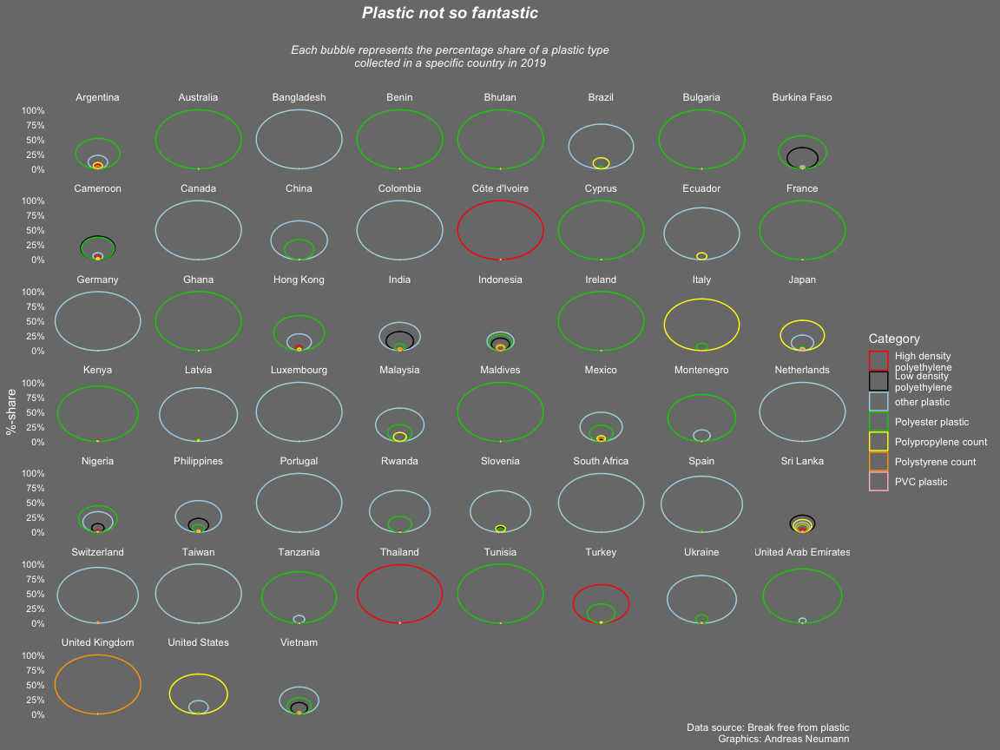

Plastic Pollution 🚮
================

This week’s CorrelAid TidyTuesday Coding Hangout included a lot of
casual chats and discussions about various \#rstats topics, so not a lot
of us managed to create a visualization (which is ok!). We still learned
a lot and - most importantly during the current times - had fun and
engaged with each other. We discussed different the advantages and
disadvantages of the two most prominent blogging frameworks in R -
[blogdown](https://bookdown.org/yihui/blogdown/) and
[distill](https://rstudio.github.io/distill/) - and learned how to
control the spacing between the dots in dotted lines:
<https://ggplot2.tidyverse.org/reference/aes_linetype_size_shape.html> .
🤓

Here are the two contributions from this week:

## A bubble chart

by Andreas Neumann

``` r
library(tidyverse)
library(ggforce)
library(scales)
library(glue)
plastics <- readr::read_csv('https://raw.githubusercontent.com/rfordatascience/tidytuesday/master/data/2021/2021-01-26/plastics.csv')
```

``` r
###load data and transform into long data set###
b<-subset(plastics, year==2019 & parent_company=="Grand Total")
tall <- b %>% gather(key = total, value = cat, empty:pvc)
tall$id <- group_indices(tall, country)
```

    ## Warning: The `...` argument of `group_keys()` is deprecated as of dplyr 1.0.0.
    ## Please `group_by()` first
    ## This warning is displayed once every 8 hours.
    ## Call `lifecycle::last_warnings()` to see where this warning was generated.

``` r
tall<-tall%>%
  mutate_if(is.numeric, ~replace(., is.na(.), 0))
###add percentages+additional data wrangling###
tall<- tall %>% dplyr::group_by(id) %>% dplyr::mutate(percent = cat/sum(cat))
tall[which(tall$country=="Cote D_ivoire"),1] <- "Côte d'Ivoire"
tall[which(tall$country=="Taiwan_ Republic of China (ROC)"),1] <- "Taiwan"
tall[which(tall$country=="NIGERIA"),1] <- "Nigeria"
tall[which(tall$country=="ECUADOR"),1] <- "Ecuador"
tall[which(tall$country=="United States of America"),1] <- "United States"
###Plot###
tall%>%
  dplyr::filter(total!="empty")%>%
  dplyr::filter(country!="EMPTY")%>%
  #subset(percent!=1.0)%>%
  #subset(percent!=0.0)%>%
  dplyr::arrange(country,percent, .by_group = TRUE)%>%
  ggplot() +
  geom_circle(aes(x0=0, y0 =percent/2, r =percent/2,color=total),alpha=5)+
  facet_wrap(~country)+  
  scale_y_continuous(labels = percent,name="%-share")+
  scale_x_continuous(breaks=NULL)+
  scale_colour_manual(name="Category",values = c("red","black","lightblue","green3","yellow","orange","pink"), labels = c("High density\npolyethylene", "Low density\npolyethylene", "other plastic","Polyester plastic","Polypropylene count","Polystyrene count","PVC plastic"))+
  labs(title = "Plastic not so fantastic\n",subtitle = "Each bubble represents the percentage share of a plastic type\ncollected in a specific country in 2019\n",caption = glue("Data source: Break free from plastic\nGraphics: Andreas Neumann"))+
  theme(plot.title = element_text(color="white", size=14,hjust = 0.5, face="bold.italic"),
        axis.title.y = element_text(color = "white"),
        axis.title.x = element_blank(),
        axis.text.y = element_text(color = "white", size = 8),
        axis.ticks.y = element_blank(),
        axis.text.x = element_blank(),
        panel.grid.major = element_line(linetype = "blank"),
        panel.grid.minor = element_blank(),
        strip.background =element_rect(fill="gray48"),
        strip.text = element_text(colour = 'white'),
        panel.background = element_rect(fill = "gray48", color = NA),
        plot.background = element_rect(fill = "gray48", color = NA),
        plot.subtitle=element_text(size=10, hjust=0.5, face="italic", color="white"),
        legend.background = element_rect(fill = "gray48", color = NA),
        legend.text = element_text(color = "white"),
        legend.title = element_text(color = "white"),
        legend.key = element_rect(fill = "gray48"),
        title = element_text(colour = "white"))
```

<!-- -->

## Using CSS grids for Rmd layout

by **Ihaddaden M. EL
Fodil**[<svg style="height:0.8em;top:.04em;position:relative;fill:#1da1f2;" viewBox="0 0 512 512"><path d="M459.37 151.716c.325 4.548.325 9.097.325 13.645 0 138.72-105.583 298.558-298.558 298.558-59.452 0-114.68-17.219-161.137-47.106 8.447.974 16.568 1.299 25.34 1.299 49.055 0 94.213-16.568 130.274-44.832-46.132-.975-84.792-31.188-98.112-72.772 6.498.974 12.995 1.624 19.818 1.624 9.421 0 18.843-1.3 27.614-3.573-48.081-9.747-84.143-51.98-84.143-102.985v-1.299c13.969 7.797 30.214 12.67 47.431 13.319-28.264-18.843-46.781-51.005-46.781-87.391 0-19.492 5.197-37.36 14.294-52.954 51.655 63.675 129.3 105.258 216.365 109.807-1.624-7.797-2.599-15.918-2.599-24.04 0-57.828 46.782-104.934 104.934-104.934 30.213 0 57.502 12.67 76.67 33.137 23.715-4.548 46.456-13.32 66.599-25.34-7.798 24.366-24.366 44.833-46.132 57.827 21.117-2.273 41.584-8.122 60.426-16.243-14.292 20.791-32.161 39.308-52.628 54.253z"/></svg>](https://twitter.com/moh_fodil)

<blockquote class="twitter-tweet">
<p lang="en" dir="ltr">
My contribution to this week
<a href="https://twitter.com/hashtag/TidyTuesday?src=hash&amp;ref_src=twsrc%5Etfw">\#TidyTuesday</a>
using ggplot2 and CSS Grid for the layout.
<a href="https://twitter.com/hashtag/RStats?src=hash&amp;ref_src=twsrc%5Etfw">\#RStats</a>
<a href="https://t.co/N6xRAXLO81">pic.twitter.com/N6xRAXLO81</a>
</p>
— Ihaddaden M. EL Fodil, Ph.D (@moh\_fodil)
<a href="https://twitter.com/moh_fodil/status/1354184005030211586?ref_src=twsrc%5Etfw">January
26, 2021</a>
</blockquote>
<script async src="https://platform.twitter.com/widgets.js" charset="utf-8"></script>

Check out the full page
[here](https://tidytuesday.correlaid.org/2021-01-26/fodil.html) and the
source code in this [GitHub
repository](https://github.com/feddelegrand7/plast).
