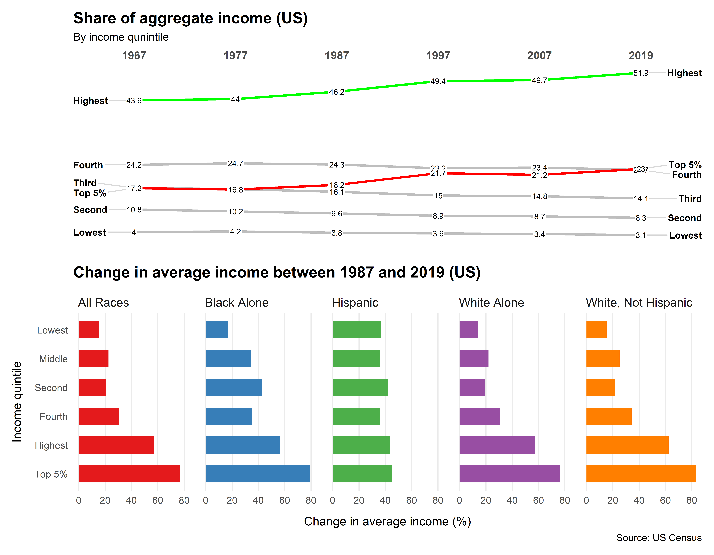

Wealth and income over time 🏚️
================


# Plot No. 1

**By Martin Wong**

```r
library(tidyverse)
library(tidytuesdayR)
library(CGPfunctions)
library(patchwork)

```
```r
tt <- tt_load("2021-02-09")
```
```r
income_mean <- tt$income_mean
income_aggregate <- tt$income_aggregate
income_aggregate_all <- income_aggregate %>%
  filter(race == "All Races") %>%
  filter(year == 1967 | year==1977 | year==1987  | year==1997 | year==2007 | year == 2019 )

income_aggregate_all$year <- factor(income_aggregate_all$year,levels = c("1967", "1977", "1987", "1997", "2007", "2019"), labels = c("1967", "1977", "1987", "1997", "2007", "2019"), ordered = TRUE)

income_mean_pivot <- income_mean %>%
  filter(year == 1987 | year == 2019 ) %>%
  filter(dollar_type == "2019 Dollars") %>%
  filter(income_dollars != "EMPTY") %>%
  filter(race!="Asian Alone" & race!="Black Alone or in Combination")  %>%
  pivot_wider(names_from = year, values_from = income_dollars)

income_mean_growth <- income_mean_pivot %>%
mutate(income_change=((`2019`-`1987`)/`1987`)*100)


theme_set(theme_minimal())
```
```r
p1=newggslopegraph(
  income_aggregate_all,
  year,income_share,
  income_quintile, 
  Title = "Share of aggregate income (US)",
  SubTitle = "By income qunintile",
  LineColor = c("Fourth" = "gray", "Highest" = "green", "Top 5%" = "red", "Third" = "gray", "Second" = "gray","Lowest" =
                  "gray"),
  XTextSize = 10,
  TitleTextSize = 14,
  Caption = NULL,
  
)

theme_set(theme_minimal())
```
```r
p2 = ggplot(income_mean_growth,aes(x = reorder(income_quintile, -income_change),y=income_change,fill=race))+
  geom_col(width=0.6)+ 
  coord_flip()+
  facet_wrap(~ race, nrow = 1)+
  theme(strip.text = element_text(
    hjust = 0, size = 11))+
  theme(panel.grid.major.y = element_blank())+
  theme(panel.grid.minor.x = element_blank())+
  scale_fill_brewer(palette="Set1")+
  theme(legend.position = "none")+
  labs(
    x =  "Income quintile" ,
    y ="Change in average income (%)",
    title="Change in average income between 1987 and 2019 (US)",
    caption="Source: US Census"
  )+
  theme(plot.title = element_text(face = "bold",
                                  margin = margin(10, 0, 10, 0),
                                  size = 14))+
  theme(axis.title.x = element_text(margin = margin(t = 10)),
        axis.title.y = element_text(margin = margin(r = 10)))
 ```       
        
```r
p1/p2

ggsave("20210209_income_inequality_2.png", width = 9, height = 7, dpi = 800)
```



# Plot No.2

**By Andreas Neumann**

```r
lifetime_earn <- readr::read_csv('https://raw.githubusercontent.com/rfordatascience/tidytuesday/master/data/2021/2021-02-09/lifetime_earn.csv')
student_debt <- readr::read_csv('https://raw.githubusercontent.com/rfordatascience/tidytuesday/master/data/2021/2021-02-09/student_debt.csv')
retirement <- readr::read_csv('https://raw.githubusercontent.com/rfordatascience/tidytuesday/master/data/2021/2021-02-09/retirement.csv')
home_owner <- readr::read_csv('https://raw.githubusercontent.com/rfordatascience/tidytuesday/master/data/2021/2021-02-09/home_owner.csv')
race_wealth <- readr::read_csv('https://raw.githubusercontent.com/rfordatascience/tidytuesday/master/data/2021/2021-02-09/race_wealth.csv')
income_time <- readr::read_csv('https://raw.githubusercontent.com/rfordatascience/tidytuesday/master/data/2021/2021-02-09/income_time.csv')
income_limits <- readr::read_csv('https://raw.githubusercontent.com/rfordatascience/tidytuesday/master/data/2021/2021-02-09/income_limits.csv')
income_aggregate <- readr::read_csv('https://raw.githubusercontent.com/rfordatascience/tidytuesday/master/data/2021/2021-02-09/income_aggregate.csv')
income_distribution <- readr::read_csv('https://raw.githubusercontent.com/rfordatascience/tidytuesday/master/data/2021/2021-02-09/income_distribution.csv')
income_mean <- readr::read_csv('https://raw.githubusercontent.com/rfordatascience/tidytuesday/master/data/2021/2021-02-09/income_mean.csv')
```
```r
library(ggtextures)
library(scales)
library(glue)
library(httr)
```
```r
##Student debt##

student_debt$norm<-round(student_debt$loan_debt/1000,0)

image1<-c("https://emojipedia-us.s3.dualstack.us-west-1.amazonaws.com/thumbs/120/apple/271/dollar-banknote_1f4b5.png")

studentw<-student_debt%>%
  group_by(race)%>%
  dplyr::filter(race!="Black")%>%
  dplyr::filter(race!="Hispanic")%>%
  ggplot(aes(year, norm,image=image1))+
  geom_isotype_col(img_width = grid::unit(1, "native"))+
  scale_y_continuous(name="White families")+
  scale_x_continuous(name="Year",breaks = seq(1989, 2016, by = 3))+
  labs(title = "Average family student loan debt\n")+
  theme(axis.title.y = element_text(color = "grey",size=35),
        axis.title.x = element_text(color = "black", margin = margin(10, 0, 0, 0)),
        axis.text.y = element_blank(),
        axis.ticks.y = element_blank(),
        axis.text.x = element_text(hjust = 0, color = "black"),
        panel.grid.major = element_line(linetype = "blank"),
        panel.grid.minor = element_blank(),
        panel.background = element_rect(fill = "grey96", color = NA),
        plot.background = element_rect(fill = "grey96", color = NA),
        plot.title = element_text(hjust = 0.5),
        title = element_text(colour = "gray22"))+
  annotate(
    geom = "curve", x = 1985.5, y = 2, xend = 1989, yend = 0.3, 
    curvature = .3, arrow = arrow(length = unit(2, "mm"))) +
  annotate(geom = "text", x = 1990, y = 2.5, label = "Each Dollar-banknote\n  represents $1000 debt", hjust = "right")

studentb<-student_debt%>%
  group_by(race)%>%
  dplyr::filter(race!="White")%>%
  dplyr::filter(race!="Hispanic")%>%
ggplot(aes(year, norm,image=image1))+
  geom_isotype_col(img_width = grid::unit(1, "native"))+
  scale_y_continuous(name="Black families")+
  scale_x_continuous(name="Year",breaks = seq(1989, 2016, by = 3))+
  theme(axis.title.y = element_text(color = "grey",size=35),
        axis.title.x = element_blank(),
        axis.text.y = element_blank(),
        axis.ticks.y = element_blank(),
        axis.text.x = element_text(hjust = 0, color = "black"),
        panel.grid.major = element_line(linetype = "blank"),
        panel.grid.minor = element_blank(),
        panel.background = element_rect(fill = "grey96", color = NA),
        plot.background = element_rect(fill = "grey96", color = NA),
        plot.title = element_text(hjust = 0.5),
        title = element_text(colour = "gray22"))

studenth<-student_debt%>%
  group_by(race)%>%
  dplyr::filter(race!="White")%>%
  dplyr::filter(race!="Black")%>%
  ggplot(aes(year, norm,image=image1))+
  geom_isotype_col(img_width = grid::unit(1, "native"))+
  scale_y_continuous(name="Hispanic families")+
  scale_x_continuous(name="Year",breaks = seq(1989, 2016, by = 3))+
  theme(axis.title.y = element_text(color = "grey",size=35),
        axis.title.x = element_blank(),
        axis.text.y = element_blank(),
        axis.ticks.y = element_blank(),
        axis.text.x = element_text(hjust = 0, color = "black"),
        panel.grid.major = element_line(linetype = "blank"),
        panel.grid.minor = element_blank(),
        panel.background = element_rect(fill = "grey96", color = NA),
        plot.background = element_rect(fill = "grey96", color = NA),
        plot.title = element_text(hjust = 0.5),
        #legend.background = element_rect(fill = "grey96", color = NA),
        #legend.text = element_text(color = "black"),
        #legend.title = element_text(color = "black"),
        #legend.key = element_rect(fill = "grey96"),
        title = element_text(colour = "gray22"))

library(ggpubr)
figure <- ggarrange(studentw,studentb,studenth,
                    #labels = c("White Families", "Black Families", "Hispanic Families" ),
                    font.label = list(size = 14, color = "grey", face = "bold", family = NULL),
                    ncol = 1, nrow = 3)
```
```r
##Housing##

home_owner$percent<-round(home_owner$home_owner_pct*100,0)  
home_owner$remain<-100-home_owner$percent
home_owner$total<-home_owner$percent+home_owner$remain

years<-c(1989,1992,1995,1998,2001,2004,2007,2010,2013,2016)

homew<-home_owner%>%
  group_by(race)%>%
  dplyr::filter(race!="Black")%>%
  dplyr::filter(race!="Hispanic")%>%
  subset(year %in% years)%>%
ggplot()+
  geom_bar(aes(year,total),stat="identity",fill="grey96")+
  geom_bar(aes(year,percent),stat="identity",fill="maroon")+
  geom_text(mapping = aes(x = year, y = percent, label = years), vjust =-1.2,size = 2.9,color="#666666")+
  scale_y_continuous(labels = function(x) paste0(x, "%"))+
  coord_polar(theta="y")+
  ggtitle( "Home ownership in the US\n from 1989 to 2016")+
  theme(axis.title.y = element_blank(),
       axis.title.x = element_blank(),
       axis.text.y = element_blank(),
       axis.ticks.y = element_blank(),
       axis.text.x = element_text(hjust = 0, color = "black"),
       panel.grid.major = element_line(linetype = "blank"),
       panel.grid.minor = element_blank(),
       panel.background = element_rect(fill = "grey96", color = NA),
       plot.background = element_rect(fill = "grey96", color = NA),
       plot.title = element_text(hjust = 0.5),
       title = element_text(colour = "grey22"))

  
homeb<-home_owner%>%
  group_by(race)%>%
  dplyr::filter(race!="White")%>%
  dplyr::filter(race!="Hispanic")%>%
  subset(year %in% years)%>%
  ggplot()+
  geom_bar(aes(year,total),stat="identity",fill="grey96")+
  geom_bar(aes(year,percent),stat="identity",fill="maroon")+
  scale_y_continuous(labels = function(x) paste0(x, "%"))+
  coord_polar(theta="y")+
  theme(axis.title.y = element_blank(),
        axis.title.x = element_blank(),
        axis.text.y = element_blank(),
        axis.ticks.y = element_blank(),
        axis.text.x = element_text(hjust = 0, color = "black"),
        panel.grid.major = element_line(linetype = "blank"),
        panel.grid.minor = element_blank(),
        panel.background = element_rect(fill = "grey96", color = NA),
        plot.background = element_rect(fill = "grey96", color = NA),
        plot.title = element_text(hjust = 0.5),
        title = element_text(colour = "grey22")) 

homeh<-home_owner%>%
  group_by(race)%>%
  dplyr::filter(race!="Black")%>%
  dplyr::filter(race!="White")%>%
  subset(year %in% years)%>%
  ggplot()+
  geom_bar(aes(year,total),stat="identity",fill="grey96")+
  geom_bar(aes(year,percent),stat="identity",fill="maroon")+
  scale_y_continuous(labels = function(x) paste0(x, "%"))+
  coord_polar(theta="y")+
  theme(axis.title.y = element_blank(),
        axis.title.x = element_blank(),
        axis.text.y = element_blank(),
        axis.ticks.y = element_blank(),
        axis.text.x = element_text(hjust = 0, color = "black"),
        panel.grid.major = element_line(linetype = "blank"),
        panel.grid.minor = element_blank(),
        panel.background = element_rect(fill = "grey96", color = NA),
        plot.background = element_rect(fill = "grey96", color = NA),
        plot.title = element_text(hjust = 0.5),
        title = element_text(colour = "grey22")) 

figure2 <- ggarrange(homew,homeb,homeh,
                     ncol = 1, nrow = 3)  

figure2<-cowplot::ggdraw(figure2) + 
  theme(plot.background = element_rect(fill="grey96", color = NA))
  
```
```r
##Wealth disparities##

race_wealth$round<-round(race_wealth$wealth_family,0)

wh<-race_wealth%>%
    group_by(race)%>%
    dplyr::filter(race!="Black")%>%
    dplyr::filter(race!="Hispanic")%>%
    dplyr::filter(race!="Non-White")%>%
  subset(type!="Median")%>%
  subset(year %in% years)

bl<-race_wealth%>%
  group_by(race)%>%
  dplyr::filter(race!="White")%>%
  dplyr::filter(race!="Hispanic")%>%
  dplyr::filter(race!="Non-White")%>%
  subset(type!="Median")%>%
  subset(year %in% years)

hi<-race_wealth%>%
  group_by(race)%>%
  dplyr::filter(race!="White")%>%
  dplyr::filter(race!="Black")%>%
  dplyr::filter(race!="Non-White")%>%
  subset(type!="Median")%>%
  subset(year %in% years)


ww<-ggplot()+
  geom_line(data=wh,aes(year,round),size=2,color="maroon")+
  geom_line(data=bl,aes(year,round),color="grey")+
  geom_line(data=hi,aes(year,round),color="grey")+
  scale_y_continuous(name="US$")+
  scale_x_continuous(name="Year")+
  ggtitle("Wealth disparity")+
  theme(axis.title.y = element_text(color = "black"),
        axis.title.x = element_text(color = "black", margin = margin(10, 0, 0, 0)),
        axis.text.y = element_text(color = "grey22", size = 12),
        axis.ticks.y = element_blank(),
        axis.text.x = element_text(hjust = 0, color = "black"),
        panel.grid.major = element_line(linetype = "blank"),
        panel.grid.minor = element_blank(),
        panel.background = element_rect(fill = "grey96", color = NA),
        plot.background = element_rect(fill = "grey96", color = NA),
        plot.title = element_text(hjust = 0.5),
        title = element_text(colour = "grey22"))


wb<-ggplot()+
  geom_line(data=wh,aes(year,round),color="grey")+
  geom_line(data=bl,aes(year,round),size=2,color="maroon")+
  geom_line(data=hi,aes(year,round),color="grey")+
  scale_y_continuous(name="US$")+
  theme(axis.title.y = element_text(color = "black"),
        axis.title.x = element_text(color = "white", margin = margin(10, 0, 0, 0)),
        axis.text.y = element_text(color = "grey22", size = 12),
        axis.ticks.y = element_blank(),
        axis.text.x = element_text(hjust = 0, color = "black"),
        panel.grid.major = element_line(linetype = "blank"),
        panel.grid.minor = element_blank(),
        panel.background = element_rect(fill = "grey96", color = NA),
        plot.background = element_rect(fill = "grey96", color = NA),
        plot.title = element_text(hjust = 0.5))


wh<-ggplot()+
  geom_line(data=wh,aes(year,round),color="grey")+
  geom_line(data=bl,aes(year,round),color="grey")+
  geom_line(data=hi,aes(year,round),size=2,color="maroon")+
  scale_y_continuous(name="US$")+
  theme(axis.title.y = element_text(color = "black"),
        axis.title.x = element_text(color = "white", margin = margin(10, 0, 0, 0)),
        axis.text.y = element_text(color = "grey22", size = 12),
        axis.ticks.y = element_blank(),
        axis.text.x = element_text(hjust = 0, color = "black"),
        panel.grid.major = element_line(linetype = "blank"),
        panel.grid.minor = element_blank(),
        panel.background = element_rect(fill = "grey96", color = NA),
        plot.background = element_rect(fill = "grey96", color = NA),
        plot.title = element_text(hjust = 0.5))

figure3 <- ggarrange(ww,wb,wh,
                     ncol = 1, nrow = 3)

```
```r
##Retirement##

retirement$round<-round(retirement$retirement/10000,0)
image2<-c("https://bremojis.com/wp-content/themes/bremojis/gfx/emojis/cane.png")

retirew<-retirement%>%
  dplyr::filter(race!="Black")%>%
  dplyr::filter(race!="Hispanic")%>%
  ggplot(aes(year, round,image=image2))+
  geom_isotype_col(img_width = grid::unit(1, "native"))+
  scale_x_continuous(name="Year",breaks = seq(1989, 2016, by = 3))+
  labs(title = "Average family liquid retirement savings\n")+
  theme(axis.title.y = element_blank(),
        axis.title.x = element_text(color = "black", margin = margin(10, 0, 0, 0)),
        axis.text.y = element_blank(),
        axis.ticks.y = element_blank(),
        axis.text.x = element_text(hjust = 0, color = "black"),
        panel.grid.major = element_line(linetype = "blank"),
        panel.grid.minor = element_blank(),
        panel.background = element_rect(fill = "grey96", color = NA),
        plot.background = element_rect(fill = "grey96", color = NA),
        plot.title = element_text(hjust = 0.5),
        title = element_text(colour = "grey22"))+
  annotate(
    geom = "curve", x = 1987, y = 4, xend = 1989, yend = 0.3, 
    curvature = .3, arrow = arrow(length = unit(2, "mm"))) +
  annotate(geom = "text", x = 1992, y = 5, label = "Each walking cane re-\npresents $10000 savings", hjust = "right")


retireb<-retirement%>%
  dplyr::filter(race!="White")%>%
  dplyr::filter(race!="Hispanic")%>%
  ggplot(aes(year, round,image=image2))+
  geom_isotype_col(img_width = grid::unit(1, "native"))+
  scale_x_continuous(name="Year",breaks = seq(1989, 2016, by = 3))+
  theme(axis.title.y = element_blank(),
        axis.title.x = element_blank(),
        axis.text.y = element_blank(),
        axis.ticks.y = element_blank(),
        axis.text.x = element_text(hjust = 0, color = "black"),
        panel.grid.major = element_line(linetype = "blank"),
        panel.grid.minor = element_blank(),
        panel.background = element_rect(fill = "grey96", color = NA),
        plot.background = element_rect(fill = "grey96", color = NA),
        plot.title = element_text(hjust = 0.5),
        title = element_text(colour = "grey22"))

retireh<-retirement%>%
  dplyr::filter(race!="White")%>%
  dplyr::filter(race!="Black")%>%
  ggplot(aes(year, round,image=image2))+
  geom_isotype_col(img_width = grid::unit(1, "native"))+
  scale_x_continuous(name="Year",breaks = seq(1989, 2016, by = 3))+
  theme(axis.title.y = element_blank(),
        axis.title.x = element_blank(),
        axis.text.y = element_blank(),
        axis.ticks.y = element_blank(),
        axis.text.x = element_text(hjust = 0, color = "black"),
        panel.grid.major = element_line(linetype = "blank"),
        panel.grid.minor = element_blank(),
        panel.background = element_rect(fill = "grey96", color = NA),
        plot.background = element_rect(fill = "grey96", color = NA),
        plot.title = element_text(hjust = 0.5),
        title = element_text(colour = "gray22"))

figure4 <- ggarrange(retirew,retireb,retireh,
                               ncol = 1, nrow = 3)
```
```r
##Assemble the plot##

figuretotal<-ggarrange(figure,figure2, figure3,figure4, ncol=4,nrow=1)
cowplot::ggdraw(figuretotal) + 
  theme(plot.background = element_rect(fill="grey96", color = NA))
```


