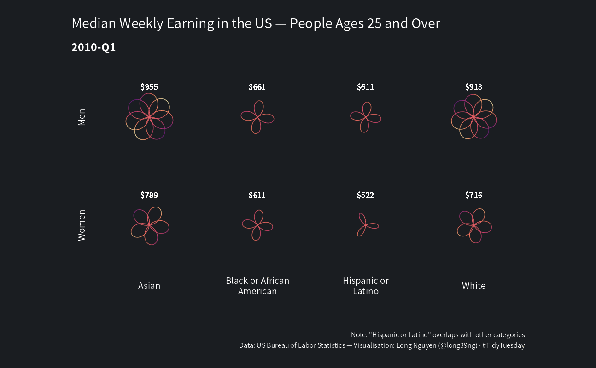
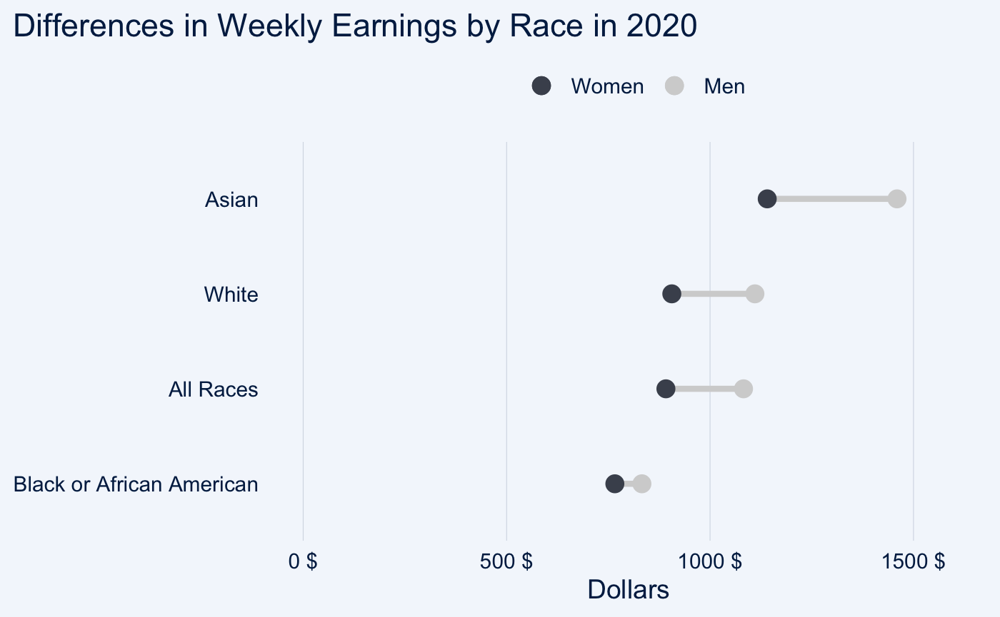
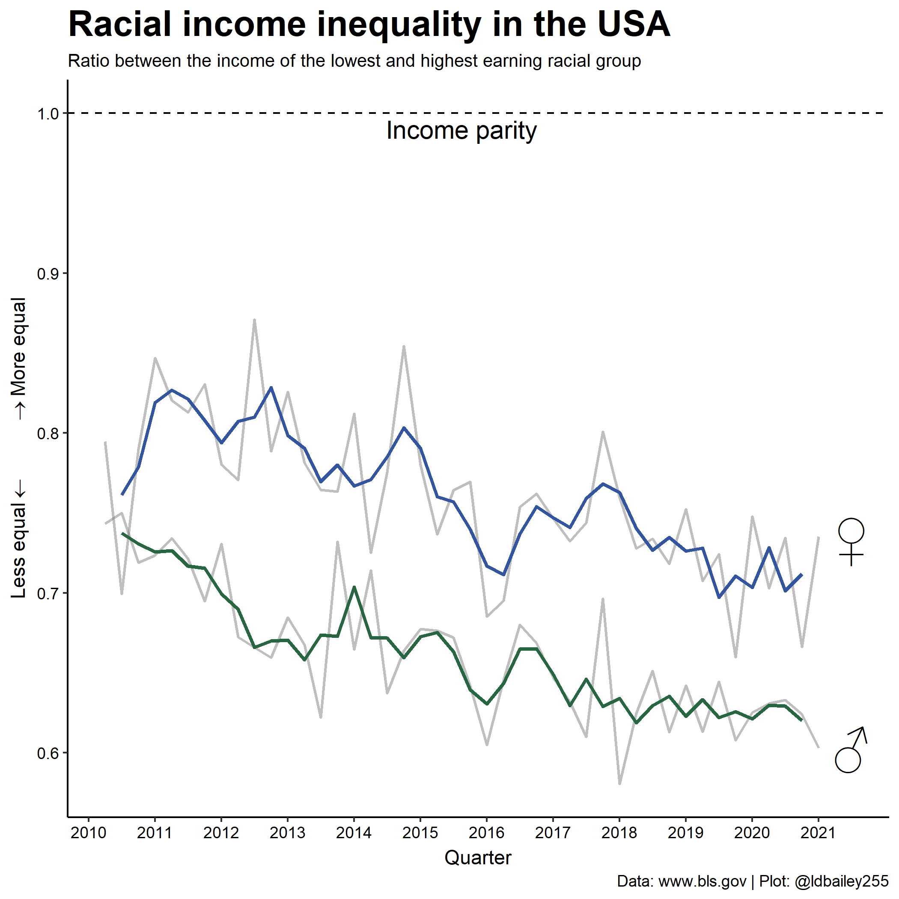

Employment and Earnings 💸
================

## “K-Chart” by Cédric Scherer

``` r
library## packages
library(tidyverse)
library(ggtext)
library(here)
library(glue)
library(systemfonts)
library(pdftools)
library(patchwork)

theme_set(theme_void(base_family = "Roboto Condensed"))

theme_update(
  axis.text.x = element_text(size = 9, color = "grey25", vjust = 1,
                             margin = margin(t = -10)),
  legend.position = "none",
  panel.grid.major.y = element_line("grey92", size = .9),
  plot.margin = margin(27, 25, 5, 25),
  plot.background = element_rect(fill = "white", color = NA),
  plot.subtitle = ggtext::element_textbox_simple(
    color = "grey25", size = 14, lineheight = 1.2, margin = margin(t = 15, b = 0)
  ),
  plot.caption = element_text(color = "grey25", size = 9, hjust = .5,
                              face = "italic", margin = margin(t = 12, b = 5))
)

theme_patchwork <- 
  theme(
    plot.title = element_text(color = "grey10", size = 24,
                              family = "Roboto Black", face = "bold",
                              margin = margin(t = 10, b = 0))
  )

## Data
df_employed <- readr::read_csv('https://raw.githubusercontent.com/rfordatascience/tidytuesday/master/data/2021/2021-02-23/employed.csv')

## Data preparation
df_employed_2020 <-
  df_employed %>% 
  filter(year == 2020, !is.na(industry),
         !industry %in% c("Men", "Women", "White", "Black or African American", "Asian")) %>% 
  mutate(
    industry = if_else(industry == "Other services, except private households", 
                       "Other services", industry),
    industry = if_else(str_detect(industry, "trade"), 
                       "Wholesale and retail trade", industry),
    race_gender = str_replace(race_gender, " or ", " and ")
  )

df_employed_2020_total <-
  df_employed_2020 %>% 
  filter(race_gender == "TOTAL") %>% 
  group_by(industry) %>% 
  summarize(employ_n = sum(employ_n, na.rm = TRUE)) %>% 
  mutate(total = sum(employ_n)) %>% 
  group_by(industry) %>% 
  mutate(perc = employ_n / total) %>% 
  ungroup() %>% 
  arrange(-employ_n) %>% 
  add_row(industry = "SUM") %>% 
  mutate(
    industry = fct_reorder(industry, -employ_n),
    rank = row_number()
  )

## Function to create plot for the sepcific population groups (only total shown here)
k_plot_div <- function(group, pos = .6, annotation) {
  df <- df_employed_2020 %>% 
    filter(race_gender == group) %>% 
    group_by(industry) %>% 
    summarize(employ_n = sum(employ_n, na.rm = TRUE)) %>% 
    mutate(total = sum(employ_n)) %>% 
    group_by(industry) %>% 
    mutate(perc = employ_n / total) %>% 
    ungroup() %>% 
    mutate(
      employ_stand = employ_n / max(employ_n),
      employ_lab = case_when(
        employ_n > 1000000 ~ paste0(format(employ_n / 1000000, big.mark = ",", digits = 1, trim = TRUE), "M"),
        employ_n > 1000 ~ paste0(format(employ_n / 1000, big.mark = ",", trim = TRUE), "K"),
        TRUE ~ paste0(employ_n)
      )
    ) %>% 
    left_join(df_employed_2020_total %>% dplyr::select(industry, rank)) %>% 
    arrange(rank) %>% 
    mutate(
      lag = lag(perc),
      end = cumsum(perc),
      end = if_else(!is.na(lag), end, perc), 
      start = end - perc,
      img = glue("{here()}/img/industries/{industry}.png")
    ) %>% 
    add_row(
      industry = "SUM", rank = 17,
      img = glue("{here()}/img/industries/Sum.png")
    ) %>% 
    mutate(
      industry = factor(industry, levels = df_employed_2020_total$industry),
      industry_lab = str_wrap(industry, 15),
      industry_lab = if_else(str_detect(industry_lab, "Mining"), 
                             "Mining, quarrying,\noil and gas", industry_lab),
      industry_lab = case_when(
        str_detect(industry_lab, "Mining") ~ "Mining, quarrying\nand oil/gas\nextraction", 
        str_detect(industry_lab, "Agriculture") ~ "Agriculture\nand related", 
        TRUE ~ industry_lab
      )
    )
  
  df_sum <- df %>% 
    dplyr::select(ind = rank, industry, perc, end) %>% 
    mutate(rank = 17, mid = end - perc / 2) 
  
  lab <- tibble(x = 12.3, y = pos, text = annotation)
  
  g <- ggplot(df, aes(rank, employ_stand)) +
    geom_rect(
      data = tibble(a = c(.6, Inf), b = c(-Inf, 17.4), c = -Inf, d = Inf),
      aes(xmin = a, xmax = b, ymin = c, ymax = d),
      stat = "unique", inherit.aes = FALSE,
      fill = "white", color = NA
    ) +
    ## bars total
    geom_col(width = .8, fill = "grey65") +
    ## colored waterfall bars
    geom_rect(
      aes(xmin = rank - .393, xmax = rank + .393,
          ymin = start, ymax = end, fill = industry,
          fill = after_scale(colorspace::lighten(fill, .2)),
          color = industry), size = .4
    ) +
    ## colored end bar total
    geom_linerange(
      aes(xmin = rank - .4, xmax = rank + .4, color = industry),
      size = 2
    ) +
    ## connections waterfall bars
    geom_linerange(
      aes(xmin = rank + .408, xmax = rank + .6, y = end),
      size = .4, color = "grey65", linetype = "22"
    ) +
    ## labels bar total
    geom_text(
      aes(label = employ_lab),
      nudge_y = .0165,
      family = "Roboto Condensed",
      size = 3.5,
      hjust = .5
    )  +
    ## summary bar
    geom_col(
      data = df_sum,
      aes(rank, perc, group = rev(ind)),
      fill = "grey85", width = .8
    ) +
    ## separator stacks summary bar
    geom_linerange(
      data = df_sum,
      aes(xmin = rank - .4, xmax = rank + .4, y = end, color = industry),
      size = .6#, color = "grey65"
    ) +
    ## labels percentages
    ggrepel::geom_text_repel(
      data = df_sum,
      ggplot2::aes(x = 17.4, y = mid, color = industry,
                   label = scales::percent(perc, accuracy = .1)),
      xlim  = 17.905,
      family = "Roboto Condensed", size = 3.4, fontface = "bold", hjust = 1,
      direction = "y", force = .5, min.segment.length = 0, segment.size = .5,
      segment.curvature = -0.15, segment.ncp = 3, segment.angle = 90,
      segment.inflect = FALSE, box.padding = .025
    ) +
    ## icons
    ggimage::geom_image(aes(y = -.04, image = img), 
                        stat = "unique", by = "width", 
                        size = .026, asp = 1.7) +
    coord_cartesian(clip = "off") +
    scale_x_continuous(expand = c(0, 0), 
                       limits = c(.45, 18.1), breaks = 1:17, 
                       labels = unique(df$industry_lab)) +
    scale_y_continuous(breaks = 0:5 / 5, limits = c(-.05, NA)) +
    ggsci::scale_fill_d3(palette = "category20b") +
    ggsci::scale_color_d3(palette = "category20b") +
    labs(title = glue("{group} Citizens")) +
    ## turn title into textbox
    theme(
      plot.title = ggtext::element_textbox_simple( 
        family = "Roboto Black", face = "bold", size = 20,
        color = "grey25", box.color = "grey65", fill = "white", linetype = 1,
        r = grid::unit(3, "pt"), padding = margin(14, 10, 10, 17)
      )
    )
  
  if (!is.na(annotation)) {
    g <- g +
    ## annotation box
    ggtext::geom_textbox(
      data = lab, aes(x = x, y = y, label = text),
      inherit.aes = FALSE,
      family = "Roboto Condensed", size = 3.9,
      color = "grey25", lineheight = 1.25,
      box.color = "grey85", width = unit(6.45, "inch"),
      box.padding = unit(c(10, 10, 10, 10), "pt")
    )
  }
  
  return(g)
}

## labels
subtitle <- "The **Current Population Survey (CPS)** is a monthly survey of households conducted by the **U.S. Bureau of Census for the Bureau of Labor Statistics**. It provides a comprehensive body of data on the labor force, employment, unemployment, persons not in the labor force, hours of work, earnings, and other demographic and labor force characteristics. The following visualizations show the overall number (grey bars) and distribution (colored bars) per industry in 2020. The industries are sorted by the number of employed persons overall."

caption <- "Visualization: Cédric Scherer  •  Data:  Labor Force Statistics from the Current Population Survey (2020), U.S. Bureau of Labor Statistics (BLS)"

## Plot Total Population

## loop to find combination since ggrepel segments are sometimes too long
## even with fixed xlim and seed — no clue why ¯\_(ツ)_/¯
for(i in 1:25) {
  k_total <- k_plot_div("TOTAL", annotation = NA) +
    labs(title = "Employed Persons in the United States of America by Industry (2020)",
         subtitle = subtitle,
         caption = caption) +
    theme(plot.margin = margin(25, 25, 10, 25),
          plot.caption = element_text(margin = margin(t = 20, b = 5)))

  ggsave(here("plots", "2021_09", glue("2021_09_Employment_Total_{i}.pdf")),
         width = 16, height = 11.2, device = cairo_pdf)
}
```


# Plot No. 2

**By Long Nguyen**

```{r setup, include=FALSE}
knitr::opts_chunk$set(echo = TRUE, collapse = TRUE, comment = "#>")
```

```{r load, message=FALSE}
library(tidyverse)
library(ragg)
```

```{r data}
earn <- "https://raw.githubusercontent.com/rfordatascience/tidytuesday/master/data/2021/2021-02-23/earn.csv" %>% 
  read_csv(col_types = "cccciiii")
```

```{r generate}
rose <- function(petals, angle = 0, scale = 1) {
  rad <- pi * angle / 180
  df <- data.frame(theta = seq(0, (petals - 2) * pi, by = pi / 180)) %>% 
    mutate(x = scale * cos(petals / (petals - 2) * theta + rad) * cos(theta),
           y = scale * cos(petals / (petals - 2) * theta + rad) * sin(theta))
  df
}
roses <- earn %>% 
  mutate(quarter_label = glue::glue("{year}-Q{quarter}"),
         date = lubridate::yq(quarter_label),
         race2 = if_else(race == "All Races", ethnic_origin, race)) %>%
  filter(age == "25 years and over",
         race2 != "All Origins",
         sex != "Both Sexes") %>% 
  mutate(petals = median_weekly_earn %/% 100 - 2) %>% 
  group_by(sex, race2) %>% 
  mutate(angle = row_number() * 15,
         points = pmap(
           list(petals, angle, median_weekly_earn),
           function(x, y, z) rose(petals = x, angle = y, scale = z)
         )) %>% 
  ungroup() %>% 
  select(sex, race2, quarter_label, median_weekly_earn, points) %>% 
  unnest(points) %>% 
  group_split(quarter_label)
```

```{r frames, warning=FALSE}
agg_png("figs/tmp/frame-%02d.png",
        width = 1294, height = 800, res = 96, bg = "#1A1D21")
walk(roses, ~ print({
  .x %>% 
  group_by(sex, race2) %>% 
  mutate(max_y = max(y),
         median_weekly_earn = if_else(row_number() == 1,
                                      median_weekly_earn,
                                      NA_integer_)) %>% 
  ungroup() %>% 
  ggplot() +
  geom_path(aes(x, y, colour = x * y), show.legend = FALSE) +
  geom_text(aes(x = 0, y = max_y,
                label = scales::dollar(median_weekly_earn)),
            colour = "white", size = 5, nudge_y = 350) +
  scale_colour_viridis_c(option = "magma", begin = .3) +
  facet_grid(sex ~ str_wrap(race2, 17), switch = "both") +
  coord_equal(xlim = 1800 * c(-1, 1), ylim = 1800 * c(-1, 1), clip = "off") +
  labs(title = "Median Weekly Earnings in the US — People Ages 25 and Over",
       subtitle = .x$quarter_label[1],
       caption = "Note: \"Hispanic or Latino\" overlaps with other categories\nData: US Bureau of Labor Statistics — Visualisation: Long Nguyen (@long39ng) · #TidyTuesday") +
  theme_void(base_size = 20) +
  theme(text = element_text(family = "Source Sans Pro",
                            colour = "white"),
        plot.background = element_rect(fill = "#1A1D21", colour = "#1A1D21"),
        plot.margin = margin(20, 20, 20, 20),
        plot.title.position = "plot",
        plot.subtitle = element_text(face = "bold",
                                     margin = margin(20, 10, 20, 10)),
        plot.caption = element_text(size = 12,
                                    lineheight = 1.2,
                                    margin = margin(60, 10, 10, 10)),
        plot.caption.position = "plot",
        strip.text.y = element_text(margin = margin(10, 20, 10, 10)))
}))
dev.off()
```

```{r roses-gif}
system("convert -delay 25 figs/tmp/*.png figs/roses.gif")
fs::dir_delete("figs/tmp/")
```




# Plot No.3

**By Lisa Reiber**



# Plot No.4

**By Liam Bailey**


