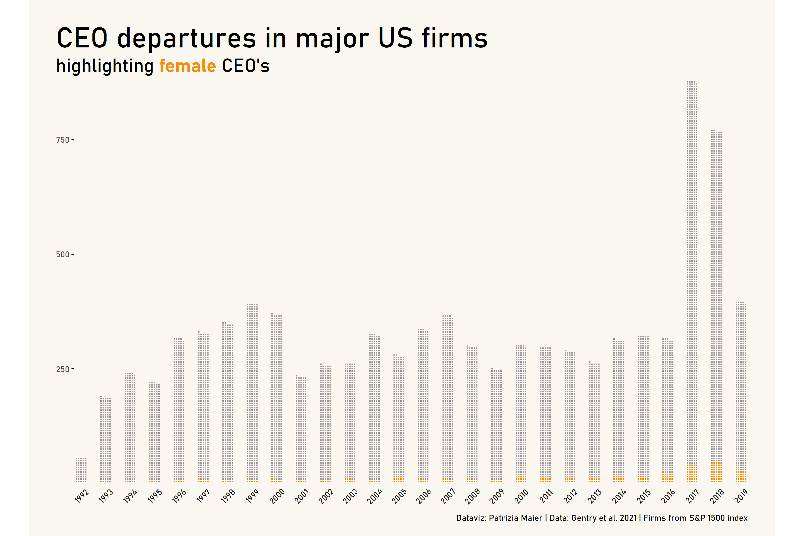
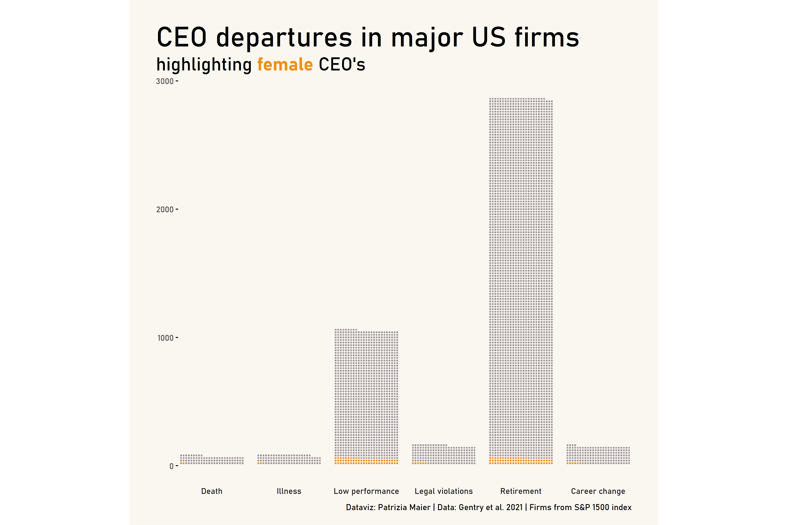

CEO Departures
================

```r
# get packages 
library(tidyverse)
library(gender)
library(genderdata)
library(extrafont)
library(ggtext)
library(waffle)
# font_import() # only once 
loadfonts(device = "win", quiet = TRUE) # every time 
# windowsFonts() # to check available options 
```
```r
# get tidy tuesday data 
tuesdata <- tidytuesdayR::tt_load('2021-04-27')
departures <- tuesdata$departures
```
```r
# text mining gender information (only male/female)
# extract names
names <- departures$exec_fullname %>% 
  str_split_fixed(pattern=" ", n=5) %>% # split names into 5 column matrix
  as_tibble() %>% # convert to tibble
  mutate(first_name=case_when(
    str_detect(V1, "\\.") ~ V2, # if abbreviated first name, get second name
    TRUE ~ V1 # else first name))
```
```r
# perform gender guess prediction 
gender_guess <- names$first_name %>% 
  gender(years = c(1920, 1985), method = "ssa") %>% # apply gender estimation
  select(!starts_with("year")) %>% # select variables 
  distinct() %>%  # remove duplicates 
  rename("gender_name"="gender") # rename variable for clarity 
```
```r
# Caution: Some names are ambiguous and can be female or male (see proportion). 
# In the data set, quite a few CEO's with highly likely "female" names are actually "male". 
# This is implied by the information in 'notes' (e.g., "Mr. ", "he", ...).
# Besides, there are quite a few NA's in case of abbreviated first names (e.g., "L.").
# --> Therefore we need more text mining based on 'notes'. 
```
```r
# add information from 'notes'
indicator_male <- c("\\Whe\\W", "\\Whe's\\W","\\Whis\\W", "\\WMr\\W")
indicator_female <- c("\\Wshe\\W", "\\Wshe's\\W", "\\Wher\\W", "\\WMrs\\W", "\\WMs\\W", "\\Wlady\\W")
```
```r
departures <- departures %>% 
  bind_cols(names) %>% 
  left_join(gender_guess, by=c("first_name"="name")) %>%  
  mutate(gender_notes_fem=str_detect(notes, regex(paste(indicator_female, collapse = "|"), ignore_case = T)),
         gender_notes_male=str_detect(notes, regex(paste(indicator_male, collapse = "|"), ignore_case = T))) %>% 
  mutate(final_gender_guess=case_when(
    proportion_male > 0.99 ~ "male",
    proportion_female > 0.99 ~ "female",
    gender_notes_male & !gender_notes_fem ~ "male",
    gender_notes_fem & !gender_notes_male ~ "female",
    !gender_notes_male & !gender_notes_fem ~ gender_name)) %>% 
  mutate(final_gender_guess=as.factor(final_gender_guess))
```
```r
# summary(departures$final_gender_guess)
# female   male   NA's 
#   299   8850    274 
```
```r
# prepare data for plotting 
data_gender <- departures %>% 
  group_by(fyear) %>% 
  count(final_gender_guess) %>% 
  drop_na(final_gender_guess) %>% 
  complete(final_gender_guess, fill=list(n=0)) %>% 
  filter(fyear>=1992 & fyear <2020)
```
```r
# create waffle plot
p1 <- ggplot(data_gender, aes(fill = final_gender_guess, values = n)) +
  geom_waffle(color = "#faf7f1", size = .5, n_rows = 5, flip = TRUE) +
  facet_wrap(~fyear,  nrow = 1, strip.position = "bottom") +
  scale_fill_manual(values = c("#ef8f10", "#9f969b")) + 
  scale_x_discrete() + 
  scale_y_continuous(labels = function(x) x * 5, # make this multiplier the same as n_rows
                     expand = c(0,0)) +
  coord_equal(clip="off") + 
  theme_minimal() +
  theme(plot.background = element_rect(fill = "#faf7f1", linetype = "blank"),
        plot.title = element_markdown(size=30), 
        plot.title.position = "plot",
        plot.subtitle = element_markdown(size=20),
        plot.caption = element_markdown(size=9),
        plot.caption.position = "plot",
        plot.margin = unit(c(1,1,0.5,1), "cm"),
        panel.grid = element_blank(),
        panel.spacing.x = unit(0.75, "lines"),
        axis.ticks.y = element_line(),
        legend.position = "none", 
        legend.title = element_blank(),
        legend.direction = "horizontal",
        text=element_text(family = "Bahnschrift", size=11),
        strip.switch.pad.wrap = unit(0, "cm"),
        strip.text = element_text(angle = 45)) +
  labs(title="\nCEO departures in major US firms", 
       subtitle="highlighting **<span style = 'color:#ef8f10;'>female</span>** CEO's",
       caption = "Dataviz: Patrizia Maier | Data: Gentry et al. 2021 | Firms from S&P 1500 index") 
```

# Plot No. 1 

**By Patrizia Maier**



*Bonus Plot:*

